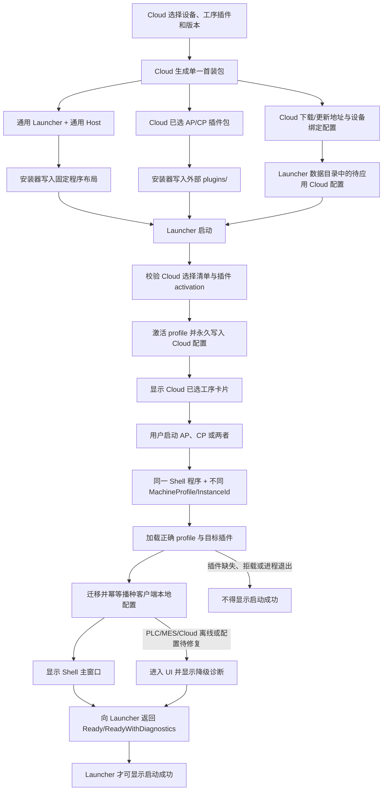
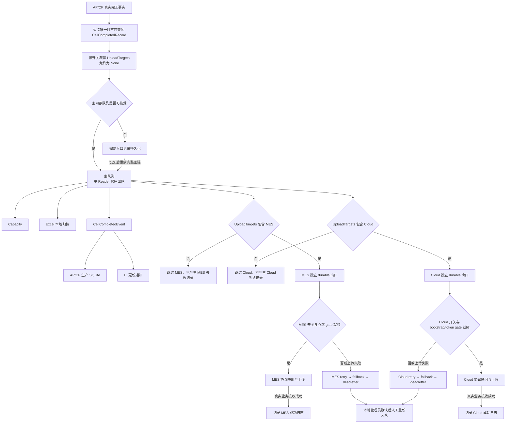
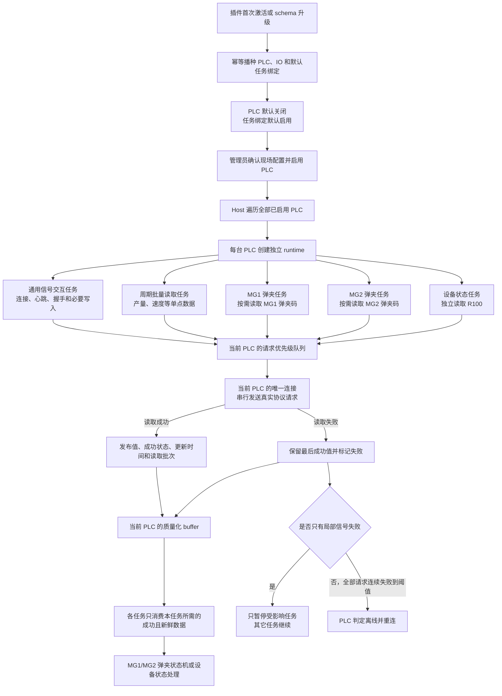

# 客户端宿主、插件、Launcher 与 Cloud/MES 临时业务规则

> **状态：待后续统一处理**
>
> 本文只固化用户确认的业务口径，不代表生产代码已经实现或验收，也不授权本轮修改源码、测试、数据库、配置或部署链路。待其它窗口完成后，必须重新核对最终源码，再把仍然有效的规则迁入正式客户端规则或唯一专题契约，并删除本临时目录。

## 1. 文档定位与术语边界

本文用于防止后续开发、重构、架构治理或 AI 修改时重新发明、合并、绕过或删除已经确认的客户端成熟链路。

- **通用 Host**：唯一的 Launcher、Shell、共享运行时和通用基础设施，不包含 AP、CP 等具体工序业务源码。
- **工序插件**：AP、CP 等独立外部插件，承载工序状态机、PLC/IO 模板、MES 映射、业务参数和工序 UI。
- **Cloud 首装注入**：Cloud 在生成下载包时一次性选择插件和版本，并注入 Cloud 自身负责的地址、设备身份和启动凭据；安装后由 Launcher 写入永久配置，不是每次启动在线拉取。
- **客户端本地播种**：插件首次激活或 schema 升级时，把 PLC、IO、MES 和 Business 等客户端本地配置写入客户端正式存储；它不属于 Cloud 注入。
- **Ready**：Shell 主窗口已显示，正确 profile 和目标插件已完成发现、兼容校验与注册，本地迁移及初始化已经完成或形成明确可见的非阻断诊断。
- 与本文冲突的当前源码不能反向证明本文业务口径无效；当前实现差距统一记录在同目录的 `待后续处理问题.md`。

## 2. 目标业务流程

### 2.1 Cloud 首装、Launcher 激活与 Shell Ready

### 2.2 完工事实与 Cloud/MES 双链路

主队列使用单 Reader 顺序出队，但消费者的具体先后顺序不是业务契约。Capacity、Excel、生产 SQLite 和 UI 属于本地完工链；MES、Cloud 是两个相互独立的 durable 出口和后台 worker。任何一个外部出口阻塞、失败、重试或进入死信，都不得阻塞另一个出口，也不得改变本地完工结果。

## 3. 宿主、插件与 Launcher 稳定规则

### 3.1 通用宿主与多 profile

#### HL-ARCH-001：客户端必须只有一个通用宿主框架

- Launcher、Shell、共享运行时、通用 DataPipeline、诊断、权限和持久化外壳必须保持业务中立。
- AP、CP 等具体工序只能通过外部插件扩展，禁止复制工序专属 Host、Shell 或 Launcher。
- 所有工序 profile 必须启动同一份 Shell 程序，只能通过 `MachineProfile`、`InstanceId` 和启用插件集合区分运行实例。
- Host、SDK 和插件不得互相复制具体工序源码、参数、状态机或外部协议实现。

#### HL-PROFILE-001：同一台机器允许同时运行 AP 和 CP

- 同一台机器允许同时安装、显示和运行 AP、CP。
- AP、CP 必须使用各自独立且稳定的 profile、`MachineProfile` 和 `InstanceId`，不得共享单实例身份。
- 同一个 profile 同一时刻只允许一个 Shell 实例；禁止重复点击产生同 profile 多进程。
- 一个 profile 的启动、退出、故障或诊断不得改变另一个 profile 的运行结果。

### 3.2 插件唯一来源与 Cloud 首装注入

#### HL-SOURCE-001：生产插件只能来自 Cloud 统一链路

- 首装必须由 Cloud 预选插件和版本，并把通用 Host、已选插件及其 Cloud 配置组合成安装包。
- 后续插件更新只能使用 Cloud 为当前设备和已启用工序返回的正式 catalog、版本和下载地址。
- Launcher 只负责激活、绑定和更新 Cloud 已选插件，禁止从纯 `Default` 状态新增全新工序插件。
- 禁止通过手工投放目录、扫描 fallback、未绑定 catalog、本地 URL、样例包或其它旁路让未被 Cloud 选择的插件进入生产 profile。
- `Default` 只承担通用 Host 的可登录、可诊断和可修复入口，不得被解释为本地插件市场。

#### HL-CLOUD-001：Cloud 注入必须是下载时一次性永久配置

- Cloud 只能注入自身负责的内容：插件选择和版本、Cloud 下载/更新来源、Cloud Gateway 地址、`ClientCode`、`BootstrapSecret` 以及 Cloud 契约明确需要的设备绑定标识。
- Cloud 注入必须随受控安装包到达客户端，由 Launcher 校验后写入当前 profile 的永久外部配置。
- 原始待应用文件只用于一次性传递；成功落盘后必须删除或只保留不含 secret 的脱敏审计摘要。
- 客户端断网重启必须继续读取已经落盘的正式配置，禁止把 Cloud 在线可达作为读取既有配置的前提。
- 生产运行时禁止再从环境变量、程序目录默认值、插件私有绑定文件或其它来源覆盖已确认的 Cloud 配置。
- Cloud 配置写入失败必须进入明确诊断并保留可恢复输入，禁止静默应用半份绑定。

#### HL-META-001：插件静态元数据不得成为第二配置源

- `plugin.json` 只能声明模块身份、显示信息、入口、版本和 Host 兼容范围。
- activation 只能声明 profile、固定 Host 入口、独立 `InstanceId`、所属模块和插件自有初始化结构。
- 插件可以携带版本化的 PLC/IO、MES 和 Business 本地播种定义，但这些定义必须通过客户端统一播种端口写入正式存储。
- `plugin.json`、activation、`*.module.json`、Cloud 绑定文件和本地数据库之间必须有明确且唯一的 owner，禁止同一参数在多处分别生效或按偶然加载顺序覆盖。
- 插件包不得携带真实 Cloud 身份、Cloud secret 或独立 Cloud 下载地址。

### 3.3 客户端本地参数与首启播种

#### HL-CONFIG-001：客户端本地参数必须由客户端和插件共同归口

- PLC 设备、PLC IO、MES 地址、MES 身份与签名、工序 Business 参数属于客户端本地配置，禁止由 Cloud 设备绑定链注入或覆盖。
- 插件负责声明本工序的参数 schema、默认值、PLC/IO 模板和初始化数据；Host 只提供通用注册、事务和持久化端口。
- 播种完成后的正式运行必须读取客户端数据库或明确的客户端永久配置，禁止继续直接读取包内样例文件作为运行真值。
- 本地管理员按权限修改后的现场值必须成为当前客户端运行值，插件升级不得无条件恢复包内默认值。

#### HL-SEED-001：首次激活和 schema 升级必须幂等播种

- 插件首次成功激活时，必须为当前 profile 播种所需的 PLC、IO、MES 和 Business 初始配置。
- 插件 schema 升级时，只能增加新版本要求的缺失项或执行明确版本化迁移。
- 播种必须幂等，只补缺失项，禁止覆盖已有设备、IO、MES 地址、签名、现场备注或业务参数。
- 播种必须在客户端统一事务边界内完成；失败必须保留原数据并在后续启动重试未完成部分。
- 生产首启禁止启用 `ResetBeforeImport` 或任何“先清空再导入”的 destructive reset。
- 初始化代码和日志必须使用“插件配置初始化/播种”等生产语义，禁止把真实现场播种伪装成可随意删除的测试样例。

### 3.4 Launcher 激活、更新与安装事务

#### HL-LAUNCH-001：Launcher 只能激活 Cloud 已选 profile

- Launcher 必须先校验 Cloud 选择清单、已安装插件、`plugin.json`、activation、machine profile 和模块身份一致性。
- 只有 Cloud 已选且校验通过的插件才能贡献 Launcher 卡片并写入 `Modules.Enabled`。
- activation 或绑定失败只能影响对应插件/profile，并形成非阻断诊断；禁止阻断 Launcher 的通用修复 UI。
- 未被 Cloud 选择、缺少绑定或身份不一致的插件不得因目录存在而自动激活。

#### HL-UPDATE-001：Shell 运行期间禁止更新 Host 或插件

- 任一 Shell 实例运行期间，Launcher 必须禁止替换 Host 或任何插件目录。
- 启动 Shell 与开始更新必须使用同一个跨进程原子门控，保证两者不能越过彼此的检查窗口。
- 多个 Launcher 实例、AP/CP 并发 profile 和后台更新进程必须共享同一门控语义。
- 更新只允许作用于 Cloud 已选且已承担当前 profile 责任的插件，禁止借更新页面安装全新工序。
- 更新失败不得删除当前可运行版本，不得改变其它插件或其它 profile 的结果。

#### HL-INSTALL-001：插件安装必须是完整事务

- 安装前必须完成下载来源、大小、SHA256/签名、压缩包边界、`plugin.json`、入口程序集、Host 兼容和 activation 校验。
- 插件包只能先写入独立 staging；校验全部通过后才能原子替换正式目录。
- 目录替换、`install.json`、activation/profile 配置、`Modules.Enabled` 和依赖插件集合必须作为一个逻辑事务提交。
- 任一步失败必须恢复原插件目录、原安装记录和原 profile 状态，禁止留下半安装、半启用或无法回滚的组合。
- 多插件依赖安装必须整体成功或整体回滚，禁止前置依赖已替换而目标插件失败。

### 3.5 启动成功、非阻断边界与后台任务

#### HL-READY-001：启动成功必须来自 Shell Ready 握手

- `Process.Start` 返回只表示操作系统创建进程请求成功，禁止直接记录“客户端启动成功”。
- Shell 必须在正确 `InstanceId` 已占用、正确 machine profile 已加载、目标插件已发现并注册、本地迁移与初始化已完成或形成明确诊断、主窗口已显示后，向 Launcher 返回 Ready。
- Launcher 必须等待有超时和进程身份校验的 Ready 握手；目标进程提前退出、超时、profile 不匹配或目标插件缺失时不得显示成功。
- PLC、MES、Cloud 离线或业务配置待修复允许返回 `ReadyWithDiagnostics`，但必须把稳定原因和修复入口展示给用户。
- 版本上报、外部心跳和外部系统业务健康不得作为 Ready 的必要条件。

#### HL-NONBLOCK-001：业务和配置问题不得阻断修复 UI

- Launcher 和 Shell 必须始终优先进入可登录、可诊断、可修配置的 UI。
- 账号目录、账号 catalog、更新配置、Cloud 绑定、插件枚举、activation、machine profile、PLC、MES、Cloud 和 IO 配置错误必须收口为局部诊断。
- 只有 DI 容器、Avalonia 框架、主窗口或进程基础设施确实无法构造的错误才允许进入 fatal 启动错误窗。
- 非阻断不等于吞错；每个失败必须有稳定原因码、脱敏日志、受影响 profile 和修复入口。

#### HL-DP-START-001：DataPipeline 三个任务必须独立启动

- 主队列 `ProcessQueueTask`、Cloud retry task 和 MES retry task 必须拥有独立启动、停止、诊断和恢复生命周期。
- 一个任务启动失败不得停止已经启动的另外两个任务，也不得阻止 Shell 进入 Ready/ReadyWithDiagnostics。
- 本地主队列任务启动失败必须明确标记本地生产链不可用；Cloud 或 MES retry 启动失败只能标记对应外部补传链不可用。
- 运行期一个任务退出、阻塞或重启不得连带取消其它任务。

## 4. Cloud/MES 双链路稳定规则

### 4.1 完工事实与主队列

#### CM-DP-001：真实完工必须进入主队列

- 每条通过 PLC、任务绑定和工序状态机确认的真实完工事实，必须生成一条唯一的 `CellCompletedRecord`。
- `CellCompletedRecord` 必须携带原始 PLC、模块、任务、槽位和业务标识上下文。
- 无论 MES、Cloud 开关组合为何，真实完工事实都必须进入主队列。
- `UploadTargets=None` 是合法的“仅执行本地完工链”状态，禁止因为没有外部上传目标而跳过 DataPipeline。
- 只有主内存队列或完整入口持久化已经可靠接受记录时，生产任务才能提交本次状态切换。

#### CM-DP-002：本地完工链不依赖外部上传

- 主队列实际出队后，必须执行 Capacity、Excel、本地生产记录和 UI 更新。
- AP/CP 生产 SQLite 的唯一正式来源仍是主队列出队后发布的 `CellCompletedEvent`。
- MES/Cloud 开关、心跳、身份、HTTP、业务响应、重试或死信状态不得阻止或删除已经确认的本地完工事实。
- 入队成功只表示本地队列或完整入口持久化已接受，不等于 Excel 完成、UI 更新完成、MES 成功或 Cloud 成功。

#### CM-DP-003：顺序不是外部链路依赖

- 主队列保持单 Reader，单条记录按已注册消费者顺序进行本地处理和 durable 出口投递。
- Capacity、Excel、UI、MES、Cloud 的具体 `Order` 数值属于实现细节，不得提升为业务先后依赖。
- MES 和 Cloud 必须投递到两个独立的 durable 出口 worker；禁止等待其中一个上传成功后才允许另一个出口开始。
- 任一消费者失败必须在自己的失败语义内收口，禁止中断后续消费者。

#### CM-DP-004：队列溢出必须恢复完整主链

- 主内存队列满时，必须持久保存完整 `CellCompletedRecord`、完整可反序列化 `CellData` 和原始上下文。
- 溢出记录恢复后必须重新进入完整主消费链，补齐 Capacity、Excel、生产 SQLite、UI 以及记录自身声明的外部目标。
- 禁止在队列溢出时只写 Cloud/MES retry，而永久跳过本地消费者。
- 禁止同一溢出记录既直接扇出 Cloud/MES，又重放完整主链而制造重复上传。
- 溢出恢复必须使用稳定幂等身份，保证本地记录和外部上传不因重放而重复。
- 完整入口持久化也失败时必须返回拒绝；生产状态机不得移除当前活动弹夹或把该次完工记为已提交。

### 4.2 上传目标、开关与门控

#### CM-ROUTE-001：开关只裁剪新记录的上传目标

- AP/CP 完工时，根据模块 MES 开关和系统唯一 Cloud 开关计算 `UploadTargets`。
- MES 关闭时，新记录不得包含 MES 目标，也不得调用 MES consumer 或生成 MES 失败记录。
- Cloud 关闭时，新记录不得包含 Cloud 目标，也不得调用 Cloud consumer 或生成 Cloud 失败记录。
- 两者都关闭时，记录仍进入主队列并执行完整本地完工链。
- 禁止把 MES 或 Cloud 开关解释成“是否产生本地生产记录”的开关。

#### CM-ROUTE-002：历史目标责任冻结

- 一条记录一旦以 MES 或 Cloud 为目标被可靠接受，该目标责任就随原记录冻结。
- 后续关闭对应开关只能暂停该目标的上传和补传，禁止删除、跳过或改投另一通道。
- 开关重新开启且门控恢复后，只恢复本通道尚未完成的记录。
- 禁止在 retry、fallback、deadletter 或人工补传时根据当前开关重新计算原记录的 `UploadTargets`。

#### CM-GATE-001：MES 与 Cloud 门控独立

- MES 只有在记录包含 MES 目标、MES 开关开启且 MES 心跳 gate 就绪时才允许调用 MES 上传。
- Cloud 只有在记录包含 Cloud 目标、系统 Cloud 开关开启且 `ClientCode → bootstrap → DeviceId/token` 门控就绪时才允许调用 Cloud 上传。
- MES 身份不得读取或复用 Cloud 的 `ClientCode`、`DeviceId`、bootstrap secret 或 upload token。
- Cloud 身份不得读取或复用 MES 的 `upperComputerNo`、operation code、签名 token 或工站号。
- 一个 gate 就绪不能证明另一个 gate 就绪。

### 4.3 双链路隔离与零丢失

#### CM-ISO-001：运行时链路必须物理隔离

- MES、Cloud 可以复用无业务语义的接口、基类、序列化器和持久化外壳。
- MES、Cloud 的 probe、gate、durable 出口队列、worker、SQLite、retry、fallback、deadletter、诊断状态和人工补传必须分别存在。
- MES 失败只能写入 MES 通道；Cloud 失败只能写入 Cloud 通道。
- 禁止混用数据库、表名、claim token、source table、deadletter channel、身份或诊断状态。

#### CM-ISO-002：任一失败不得影响其它效果

- MES 阻塞或失败不得阻止 Cloud、本地 Excel、生产 SQLite、Capacity 或 UI。
- Cloud 阻塞或失败不得阻止 MES、本地 Excel、生产 SQLite、Capacity 或 UI。
- Excel、UI 等本地消费者失败不得删除或伪装 MES/Cloud 的执行结果。
- 每个出口必须独立记录成功、阻塞、失败、补传和死信结果，禁止用另一出口的状态代替。

### 4.4 Retry、fallback、deadletter 与人工补传

#### CM-RETRY-001：失败数据必须先可靠落盘

- 已承担目标责任的记录遇到 gate 暂时未就绪、网络失败、超时或外部业务拒绝时，必须保存完整原记录。
- MES 写入 `pipeline_mes.db` 的独立补偿链；Cloud 写入 `pipeline_cloud.db` 的独立补偿链。
- 主 retry 不可写时进入同通道 fallback；fallback 也不可写或发生永久契约错误时进入同通道 deadletter。
- deadletter 也不可写时必须生成可恢复 critical 物理证据并显式报警，禁止静默返回成功。

#### CM-RETRY-002：自动补传必须受原通道门控

- MES 补传任务只有在 MES 开关开启且 MES 心跳恢复后才能领取 MES 记录。
- Cloud 补传任务只有在系统 Cloud 开关开启且当前 Cloud bootstrap/token 门控恢复后才能领取 Cloud 记录。
- 补传必须复用记录中冻结的业务事实、PLC、模块、任务和幂等身份。
- 补传时允许使用当前有效的目标身份、token、签名和 endpoint，但禁止重算数量、条码、开始时间、完成时间或结果。

#### CM-RETRY-003：最多自动重试 20 次，随后必须进入死信

- 单通道单记录最多执行 20 次自动补传。
- 第 20 次自动补传仍失败时，必须把完整原记录可靠转入该通道 deadletter，停止自动请求。
- 禁止通过 `DateTime.MaxValue`、隐藏状态、无限延期或其它“弃置”方式代替 deadletter。
- 禁止按 30 天或其它时间自动硬删除尚未成功、尚未人工确认的 retry、fallback 或 deadletter 数据。
- 心跳或门控恢复只能恢复未耗尽重试次数的记录，禁止自动把 deadletter 重置为普通 retry。

#### CM-RETRY-004：转入死信必须零丢失

- 必须先确认 deadletter 写入成功，才能删除原 retry/fallback 记录。
- deadletter 写入失败时必须保留原记录和失败上下文，禁止先删后写。
- retry 到 deadletter 的转移不得同时留下两个可自动消费副本。
- 死信必须保留原始 `CellDataJson`、目标通道、来源表、来源记录、失败阶段、失败原因、PLC、模块、任务和业务标识。

#### CM-OPS-001：人工补传必须受控

- 只有本地管理员可以操作死信的重新入队和删除动作。
- 重新入队和删除必须二次确认，并记录目标通道、记录 ID、工序、PLC、任务、业务标识、操作者和结果。
- 人工重新入队必须写回原通道 retry，重置自动重试计数，并保持原始业务事实和幂等身份。
- 重新入队写入 retry 成功后才能删除 deadletter；任一步失败都必须保留可诊断证据。
- 删除死信属于不可恢复高危操作，禁止无权限、无确认或静默删除。

### 4.5 同源生产事实与协议映射

#### CM-DATA-001：MES 与 Cloud 消费同一份不可变生产事实

- 同一次完工只生成一份 `CellCompletedRecord` 和一份业务 `CellData`。
- MES、Cloud consumer 必须消费该记录自身携带的同一份生产事实。
- 禁止为 MES 和 Cloud 分别采集、重新查询或重新计算数量、条码、开始时间、完成时间、结果、PLC 或槽位。
- retry、fallback、deadletter 和人工补传必须保存并恢复同一份原始生产事实。

#### CM-DATA-002：允许目标协议不同

- Cloud 可以添加 `DeviceId`、request ID、幂等键、schema version 和 Cloud 授权信息。
- MES 可以添加 `upperComputerNo`、operation code、station number、timestamp、sign 和 MES 请求结构。
- 两端字段名称、信封和身份不同是协议差异，不代表允许改变生产事实。
- 目标适配器只能进行协议映射、格式转换和身份补充，禁止产生第二份业务真值。

#### CM-DATA-003：AP/CP 使用弹夹条码

- AP/CP 是模切工序，一条完工记录表示一个弹夹生命周期。
- AP/CP 当前业务唯一标识是 `ClipNo`，面向人员的名称必须使用“弹夹号”或“弹夹条码”。
- AP/CP 不得伪造不存在的电芯条码。
- 通用框架可以使用“业务唯一标识”；只有真实存在单电芯条码的其它工序才能记录“电芯条码”。

### 4.6 日志与成功语义

#### CM-LOG-001：每条业务记录必须可追溯

- MES、Cloud 直传成功、直传失败、补传成功、补传失败、进入死信和人工重新入队都必须能定位到单条业务记录。
- 日志至少包含：目标通道、PLC、模块/工序、任务或槽位、业务唯一标识、执行阶段和结果。
- AP/CP 日志的业务唯一标识必须是弹夹号。
- 批量上传可以增加批次摘要，但不能只记录数量而无法追溯批次中的每个弹夹号。

#### CM-LOG-002：上传成功必须来自真实接收结果

- “MES 上传成功”必须表示 MES HTTP 调用和 MES 业务响应均确认接收成功。
- “Cloud 上传成功”必须表示 Cloud 接口返回正式成功结果。
- 已入队、已投递出口、已写 retry、已写 fallback 或已重新入队都不得记录为上传成功。
- 一个目标成功不得输出另一个目标成功。

#### CM-LOG-003：失败、阻塞和恢复必须区分

- 开关关闭、心跳未就绪、bootstrap/token 未就绪属于 `Blocked`，不能伪装成成功或普通业务失败。
- HTTP、网络、超时、业务拒绝、序列化、持久化和容量问题属于对应失败阶段。
- 补传恢复、死信转移和人工重新入队必须输出明确恢复信息。
- 日志订阅者异常不得改变上传、持久化或补偿结果。

#### CM-LOG-004：日志不得泄露敏感信息

- 禁止输出 MES 签名 token、sign 原文、Cloud token、bootstrap secret、完整敏感 URL 或响应中的敏感数据。
- 允许输出经过约束的原因码、HTTP 状态、业务状态、异常类型和脱敏摘要。

## 5. 后续统一处理边界

其它窗口修改完成后，后续专项必须按以下顺序收口：

1. 固定 Cloud、Host、SDK、Private Plugins 最终工作区字节和对应 Git 状态。
2. 重新核对本文每条 `HL-*`、`CM-*` 规则和问题文档中的全部差距，禁止直接沿用本次动态工作区结论。
3. 由用户另行授权后，再制定生产代码、持久化、迁移和受影响测试方案。
4. 代码完成后分别验证首装选择、Cloud 一次注入、本地播种、AP/CP 并发、Ready 握手、更新互斥、安装回滚及 Cloud/MES 双链路。
5. 将仍然有效的长期规则迁入 `docs/客户端规则.md` 或唯一正式专题契约；同一规则只能保留一处正文。
6. 未解决问题进入唯一整改入口，已解决问题不保留日期式快照或滚动复盘。
7. 正式规则和源码完成对账后删除本临时目录；历史过程只由 Git 保存。

## 6. 本轮边界

- 本轮只整理本临时目录中的两份文档。
- 本轮不修改生产代码、测试、数据库、配置、正式规则、部署文件或其它窗口的脏改动。
- 本轮不运行测试、构建、打包或部署。
- 本文不新增或改变任何公共 API、接口、数据表或运行时行为。

## 7. PLC 启动、读取与任务业务规则

本章节只追加 PLC 业务口径，不修改或替代前文任何 `HL-*`、`CM-*` 规则。本文所说的“任务并行”是指不同 PLC runtime 及同一 PLC 内各任务循环可以独立运行；同一台 PLC 的真实通讯请求仍必须通过一个连接排队执行。

### 7.1 PLC 首次播种、启用与运行流程

### 7.2 PLC 身份、runtime 与任务绑定

#### PLC-ID-001：PLC 只能有一个稳定业务标识

- `PlcCode` 必须是 PLC 唯一、稳定且永久不可变的业务标识。
- 插件设备解析、运行上下文归属、任务业务身份、生产事实、日志和后续补传追溯必须使用 `PlcCode`。
- `DeviceName` 是允许现场修改的展示名称及 MES 所需字段，禁止用它查找插件设备、关联历史事实或充当业务主键。
- `NetworkDeviceId` 只允许作为本地数据库主键、外键和进程内实现细节；它不是第二个 PLC 业务身份，不得对外形成另一套匹配规则。

#### PLC-RUNTIME-001：每台已启用 PLC 必须拥有独立 runtime

- Host 必须遍历所有“已启用且设备类型为 PLC”的设备，并为每台 PLC 创建独立 runtime。
- 不同 PLC 的初始化、连接和任务循环必须并行且相互隔离；一台 PLC 连接、读取或任务失败不得停止其它 PLC。
- 同一 PLC 内可以同时运行通用任务和多个插件业务任务，但必须共用当前 PLC 的唯一通讯连接。
- 同一 PLC 的真实读写报文必须通过统一请求队列串行发送；禁止为了表面并行而默认为同一 PLC 建立多个未验证连接。
- 未启用 PLC 必须保留配置和任务绑定，但不得连接 PLC、启动该设备 runtime 或伪造在线状态。

#### PLC-BIND-001：一个 Shell 必须恰好只有一个工序任务工厂

- 一个 Shell 进程必须恰好注册一个当前工序的任务工厂，并由该工厂声明可供每台 PLC 动态选择的任务。
- Host 必须按每台 PLC 保存的启用状态、任务绑定、设备型号和必需 IO，分别决定本 PLC 启动哪些任务。
- 同一套通用 Host 必须允许不同 PLC 启用不同任务组合，禁止把 AP/CP 任务写死到 Host 全局分支。
- 工序任务工厂为零或同时存在多个时，必须跳过业务任务绑定并形成明确诊断；已经能够安全启动的 PLC 基础任务可以继续运行。
- 工厂异常、插件缺失或任务绑定问题不得阻断 Shell 进入可诊断、可修配置的 UI。

#### PLC-SEED-001：首次激活必须播种配置，但默认不得连接 PLC

- 插件首次激活时必须播种本工序所需的 PLC 设备、IO 映射和默认任务绑定；不得把“PLC 默认不连接”误写成“不播种 PLC”。
- 新播种的 PLC 设备必须默认关闭，新播种的 MG1、MG2 和设备状态任务绑定必须默认启用。
- 管理员完成现场地址、端口和 IO 核对并启用 PLC 后，已启用的默认任务绑定必须随该 PLC runtime 启动。
- 插件 schema 升级时必须逐项补齐缺失设备、IO 和任务绑定；已存在任意一条 IO 不能成为跳过其它缺失 IO 的理由。
- 播种必须幂等，只补缺失，保留现场修改的 IP、端口、PLC 地址、地址数量、名称、备注、启用状态和任务选择。
- 生产启动禁止自动执行 `ResetBeforeImport`、清空重建或其它 destructive reset。

#### PLC-TASK-001：AP/CP 必须具有三个独立业务任务

- AP 和 CP 的每台适用 PLC 必须分别提供 MG1 弹夹任务、MG2 弹夹任务和设备状态任务。
- MG1、MG2 必须可以分别绑定、启用、停用、诊断和运行；任一槽位失败不得改变另一槽位结果。
- 设备状态必须是第三个独立任务，不得重新合并进 MG1、MG2 或综合采样任务。
- PLC 连接、连接健康、通用心跳、信号交互、握手、必要写入和请求排队属于 Host 通用能力，不得伪装成第四个工序业务任务。

### 7.3 读取方式、分块与优先级

#### PLC-READ-001：不同数据必须按业务需要读取

- 实际产量、模切速度等单点数据必须由 Host 周期性批量读取，并整体发布到当前 PLC 的 buffer。
- MG1 任务必须在自己的循环中通过统一 PLC 请求协调器按需读取 MG1 弹夹码；MG2 任务必须独立按需读取 MG2 弹夹码。
- 弹夹任务必须直接获得本次读取的成功或失败结果；禁止只读取一个无法判断来源的空字符串或全零 buffer 值。
- 设备状态任务必须独立读取默认地址 `R100`，默认数据类型为 `Int16`、地址数量为 1，有效状态码为 `-1`、`0`、`1`、`2`、`3`。
- PLC 地址允许管理员现场修改；修改后仍必须满足对应数据类型和解码长度要求。
- “单点读数据”或“连续读数据”只描述一项数据占用的 PLC 地址形态，不自动决定读取频率。到底何时读取，必须由批量读取任务或对应业务任务明确负责。
- 按需读取成功后可以把本次值和质量同步到 buffer 供 UI 与诊断使用，但业务判断必须使用本次调用的明确结果。

#### PLC-BLOCK-001：近地址必须合并，远地址必须拆块

- 同一地址前缀下的单点读取必须按最小覆盖区间合并，默认单块最大长度为 100 words；插件可以声明更小的安全上限。
- `D101`、`D103`、`D108` 必须合并为从 `D101` 开始、长度 8 words 的一次读取，禁止无依据扩展为固定 `D100 × 10`。
- 当最小覆盖区间超过当前最大块长度时必须拆块；`D101`、`D201`、`D301` 在默认 100 words 上限下必须拆分。
- 不同地址前缀、无法可靠解析的地址或 PLC 协议不允许跨区读取的地址必须分别成块。
- 远地址拆块后仍通过同一 PLC 请求队列依次执行；“拆成多个任务”不等于为同一 PLC 打开多个真实连接。

#### PLC-SCHED-001：同一 PLC 必须按读取优先级排队

- 同一 PLC 的所有读写请求必须进入一个统一调度队列，禁止各任务绕过队列直接争用协议对象。
- 第一优先级是信号交互、握手、必要写入和维持协议健康所需的请求。
- 第二优先级是 MG1、MG2、设备状态等业务任务当前需要的读取。
- 第三优先级是实际产量、模切速度等周期批量读取。
- 低优先级请求等待达到受控时间后必须提升优先级，禁止因为高优先级请求持续到达而永久读不到。
- 优先级只决定同一 PLC 下一条请求先执行谁，不改变“同一 PLC 单连接串行、不同 PLC 并行”的规则。

### 7.4 Buffer、读取质量与在线状态

#### PLC-BUFFER-001：批读结果必须作为完整快照发布

- 周期批量读取必须先在当前扫描批次内收集结果，再一次性发布本批次快照，禁止读取一个信号就让业务看到半份新数据。
- 每个信号至少必须保留最后成功值、本批读取状态、最后成功时间和所属读取批次。
- 同一业务任务需要的实际产量和模切速度必须能够证明来自同一批成功读取。
- buffer 必须支持并发读取，但业务任务读取到的必须是一个已经发布完成的快照，禁止混合不同批次的中间状态。
- 从未成功读取的信号必须表达为“无有效值”，禁止自动制造数值 0 或空字符串。

#### PLC-QUALITY-001：读取失败不得伪造 0 或空值

- 某个 block 或单个信号读取失败时，必须保留该信号最后一次成功值，并把本次质量标记为失败。
- 只有 PLC 本次真实读取成功并返回全零或空字符串时，才能把它解释为真实清空。
- block 失败后的受控单点重读仍允许存在，但每个信号的最终成功或失败必须分别记录并对业务可见。
- 读取失败不得通过写 0、写空字符串、刷新成功时间或沿用旧成功质量来伪装成功。
- 业务任务发现任一必需信号失败、无有效值或已经过期时，必须暂停本轮业务处理并输出受控诊断。

#### PLC-ONLINE-001：PLC 在线与任务数据质量必须分开

- PLC 连接在线只说明通讯连接或协议请求仍可工作，不代表所有业务点位都读取成功。
- 某个地址、block 或任务所需信号失败时，只能把对应信号和任务标记为不可用；其它成功任务和其它 PLC 必须继续运行。
- 任一其它 block 成功可以证明连接仍有响应，但不得把本次失败的任务重新标记为健康。
- 只有当前 PLC 的全部协议请求连续失败达到配置阈值时，才能把 PLC 判为离线、断开连接并进入重连。
- 连接状态、信号质量、任务状态必须分别显示和记录，禁止用一个“在线”状态掩盖局部读取失败。

### 7.5 AP/CP 弹夹状态机与任务隔离

#### PLC-CLIP-001：弹夹判断必须使用本次成功条码和新鲜批读数据

- MG1 任务只能处理 MG1 弹夹码，MG2 任务只能处理 MG2 弹夹码。
- 每次准备判断弹夹新增、更换或清空时，必须先确认本次对应弹夹码读取成功。
- 实际产量和模切速度必须来自同一批成功发布且仍处于配置新鲜窗口内的批读快照。
- 只要求当前任务声明的必需信号成功；其它无关点位失败不得阻止当前任务。
- 弹夹码、实际产量或模切速度任一必需数据读取失败、无有效值或过期时，本轮不得新增、更新、完成或移除弹夹。

#### PLC-CLIP-002：空弹夹必须连续三次读取成功后确认

- 弹夹由有值变为空字符串时，只有连续三次“读取成功且结果为空”才能确认真实清空并进入后续完工处理。
- 任一次弹夹码读取失败都不得计作空值，不得推进完工，不得移除当前弹夹。
- 读取失败必须重置本轮连续空码计数；后续必须重新取得连续三次成功空码。
- 真实读取成功且得到非空弹夹码时，必须立即清除未完成的空码确认计数。
- MG1、MG2 必须分别维护自己的当前弹夹和空码确认计数，禁止相互复用。

#### PLC-ISOLATION-001：一个任务失败不得停止其它有效任务

- 某个候选任务缺少必需 IO、地址无效、数据类型不匹配或初始化失败时，只能阻止该任务。
- 同一 PLC 的其它有效业务任务、通用连接任务和读取任务必须继续启动和运行。
- 每个失败任务必须输出 `PlcCode`、任务 Key、缺失或错误信号及修复要求，禁止只把整台 PLC 标成一个无法定位的故障。
- 只有当前 PLC 的连接、协议服务或共享请求调度器无法安全工作时，才允许停止该 PLC 的全部任务。

#### PLC-NAME-001：任务名称必须直接说明职责

- `PlcIoScanTask` 容易与条码扫描混淆，后续代码整改目标名称为 `PlcSignalInteractionTask`，中文名称为“PLC 信号交互任务”。
- `PlcDataReadScanTask` 后续代码整改目标名称为 `PlcPeriodicBatchReadTask`，中文名称为“PLC 周期批量读取任务”。
- 名称中的“读取”“交互”“弹夹”“设备状态”必须对应真实职责，禁止再用一个含糊的 `Scan` 覆盖不同链路。
- 本规则只记录后续命名目标，不授权本轮修改类名、持久化任务 Key、公共接口或兼容契约。
