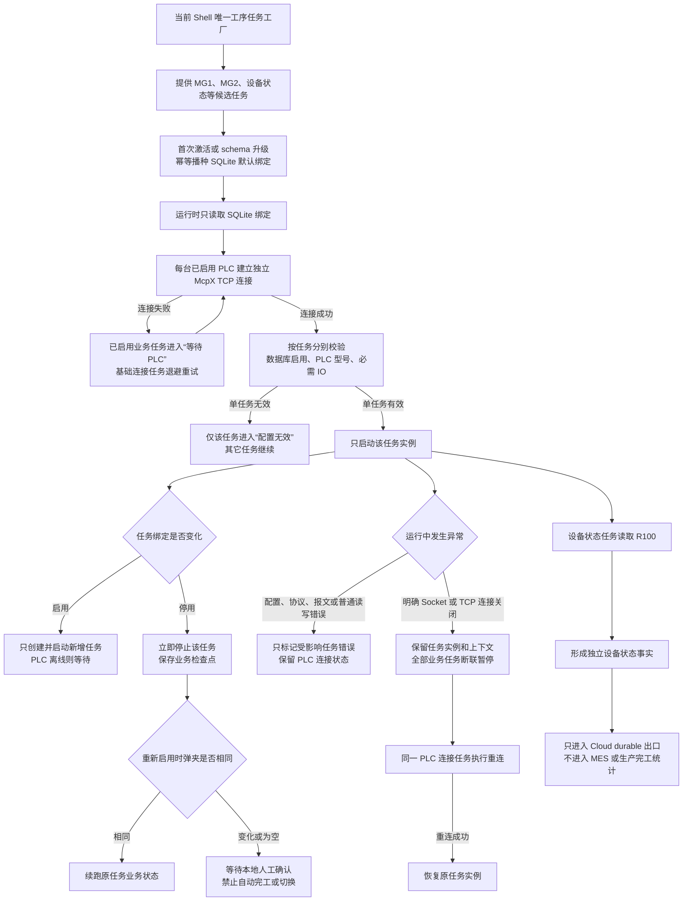

# 客户端规则

本文档约束 `IIoT.EdgeClient`。总规则见 `../../docs/总规则.md`。

## 0. 改动收口门禁

- 工作区 `../../docs/总规则.md` 是唯一默认必读入口。进入 Edge 实际修改后，只读取本文档中与本批模块直接相关的章节、相关源码和受影响测试；专题契约按边界触发，近期 git/GitHub 历史按回归或故障追溯条件读取。
- 历史事实只从 Git、发布目录和部署记录追溯；活动树不维护滚动复盘、历史核心类文档、旧计划或日期式治理/release 快照。
- 形成长期约束时直接写入本文档、专题契约或工作区总规则；真实事故只进入工作区 `docs/事故/生产事故.md` 或 `docs/事故/部署事故.md`。
- 分层、聚合根、Persistence Owner、插件 seam、PLC transport owner、架构 Rule ID、测试物理归口和 inventory/runner 重新对账规则以 `Edge架构边界契约.md` 为权威；修改项目引用、数据库 owner、聚合标记、插件依赖、Analyzer 或测试项目结构前必须先读。
- PLC/IO/Dashboard/日志/产能/实时监控/状态机/任务绑定/诊断的设备选择和状态展示契约见 `PLC选择与状态展示控制.md`，修改相关链路前必须先读。
- Avalonia 页面级组合、工具栏、表格高度、设备运行冻结槽位和配置类 UI 第二层规范见 `Edge客户端UI第二层规范.md`，修改硬件配置、IO 映射、参数、配方、IO 交互或右侧设备运行前必须先读。

## 0.1 架构边界与测试归口

- Analyzer 只执行 `Edge架构边界契约.md` 已批准的 root、owner、project role 和 seam，不得根据 `IAggregateRoot`、目录名、EF navigation、`DbSet`、类名含 `Store` 或 MediatR `INotification` 自行推断 DDD 边界。
- 当前批准的 AggregateRoot 精确为 `NetworkDeviceEntity`、`IoMappingEntity`、`PlcTaskBindingEntity`、`SerialDeviceEntity`、`SystemConfigEntity`；`DeviceParamEntity` 为 dormant/未裁决，禁止新增其写 Repository，直到独立裁决。
- EF navigation/cascade 只表达 ORM/lifecycle 关系，不证明 aggregate ownership。`IoMappingEntity`、`PlcTaskBindingEntity` 当前是按 `NetworkDeviceId` 分区的独立配置 root；`NetworkDevice` 两个 navigation collection 必须使用 private backing field + public read-only view，EF 只通过 field access 完成 fix-up，聚合外不得直接改集合。声明类型、运行时只读性与两条真实 SQLite Include/fix-up 由受影响 Domain/Persistence owner 测试证明。
- 具体 `DbContext.SaveChanges*`、Dapper/SQLite connection/transaction/raw SQL、migration/schema DDL 只能出现在契约登记的 persistence owner；Application 调用 `IRepository`/Unit of Work 端口、ViewModel 调用窄 query/store port 不得误报。
- 模块 Production Task 的外部上传只允许进入 `IDataPipelineService`；插件不得直接持有 MES/Cloud HTTP/uploader。PLC concrete driver/transport 只允许登记的 DeviceComm owner 构造、持有和释放。
- 测试顶层统一归为 `Architecture`、`Security`、`Business`、`DeploymentContract`、`Quality`、`CrossProject`；现有 Unit/Aggregate/Application/Contract/Conformance/Persistence/Workflow/Integration/EndToEnd/UI 等作为 Business 的细分失效机制保留。
- 默认验证只运行不可弱化的 Architecture/Security 与 diff/owner 选出的受影响 Business。测试项目 metadata、selector 输出和本次 `current-discovery.json` 描述当前提交真实分类、选择与执行结果；仓库不提交 runner/case roster 或历史数量 baseline，也不以 inventory 审批测试变更。确认删除的功能必须同批删除专属测试，禁止 dummy case、空工程或兼容入口维持旧数字。
- 普通 `dotnet build` 只执行编译和编译期架构/安全门禁，不得由 `Directory.Build.targets` 无条件启动 Edge 部署策略或部署行为测试；`DeploymentContract` 只由受影响 selector 调用。
- 单仓全量、coverage、mutation、duplication、Quality 与 CrossProject/三端对齐只在用户当前轮明确授权时运行；未知文件无法归属时停止并列出文件，不退化全量。

## 1. 启动红线

- Launcher/Shell 必须能启动到可登录、可诊断、可修配置的 UI。
- 业务配置、设备配置、PLC、MES、Cloud、IO 映射、模块绑定、profile 诊断失败不得阻断启动。
- 启动校验可记录日志、更新诊断状态、显示非阻断告警；不得因缺配置、空可选 IO、端点不可达、模块诊断失败抛 fatal。
- 只有宿主无法构造的进程级错误允许停止启动。
- Launcher 最后兜底错误窗只保留给宿主、DI 或框架无法继续构造的真正 fatal；账号目录、账号 catalog、更新配置和导入数据等业务初始化失败仍必须走非阻断诊断并进入可修复 UI。fatal 窗口只显示本地化固定摘要、稳定原因码或异常类型，不得显示原始异常消息、路径、完整 URL、响应正文、token 或 secret。
- 改启动、诊断、reconciliation、validation 代码时，必须验证真实启动路径或等价集成测试。
- Launcher 判断某一 Shell profile 是否正在运行时，必须验证单实例互斥量当前确实被占用；只因命名互斥量对象仍可打开不得判定进程存活。跨平台修改必须覆盖“名称存在但无人持有”和“由其它线程/进程持有”两种回归，并用真实 Launcher 按钮逐卡启动验收。
- 同步启动 filesystem/path adapter 只允许把 `ArgumentException`、`NotSupportedException`、`IOException`、`UnauthorizedAccessException`、`SecurityException` 翻译为非阻断诊断或安全 fallback；未知异常和直接 `OperationCanceledException` 必须原实例传播。插件 manifest 与 load 边界必须分别使用 `ModulePluginManifestException`、`ModulePluginLoadException`，保留批准底层失败的 inner exception；catalog 只能捕获对应 typed failure，禁止恢复 bare catch、无 filter 的 `catch (Exception)` 或在配置加载器外层吞掉 catalog 实现异常。内部 fault-injection seam 不得改变默认生产路径，每个 path probe、resolver、loader 最多执行一次。

### 1.1 通用宿主与多 profile

#### HL-ARCH-001：客户端必须只有一个通用宿主框架

- Launcher、Shell、共享运行时、通用 DataPipeline、诊断、权限和持久化外壳必须保持业务中立。
- AP、CP 等具体工序只能通过外部插件扩展，禁止复制工序专属 Host、Shell 或 Launcher。
- 所有工序 profile 必须启动同一份 Shell 程序，只能通过 `MachineProfile`、`InstanceId` 和启用插件集合区分运行实例。
- Host、SDK 和插件不得互相复制具体工序源码、参数、状态机或外部协议实现。

#### HL-PROFILE-001：同一台机器允许同时运行 AP 和 CP

- 同一台机器允许同时安装、显示和运行 AP、CP。
- AP、CP 必须使用各自独立且稳定的 profile、`MachineProfile` 和 `InstanceId`，不得共享单实例身份。
- 同一个 profile 同一时刻只允许一个 Shell 实例；禁止重复点击产生同 profile 多进程。
- 一个 profile 的启动、退出、故障或诊断不得改变另一个 profile 的运行结果。

### 1.2 Launcher 发布控制面、Cloud 首装与更新事务

#### HL-SOURCE-001：生产插件只能来自 Cloud 统一链路

- 首装必须由 Cloud 预选插件和版本，并把通用 Host、已选插件及其 Cloud 配置组合成安装包。
- 后续插件更新只能使用 Cloud 为当前设备和已启用工序返回的正式 catalog、版本和下载地址。
- Launcher 只负责激活、绑定和更新 Cloud 已选插件，禁止从纯 `Default` 状态新增全新工序插件。
- 禁止通过手工投放目录、扫描 fallback、未绑定 catalog、本地 URL、样例包或其它旁路让未被 Cloud 选择的插件进入生产 profile。
- `iiot-enabled-plugins.json` 是 Launcher activation 的唯一选择输入；只接受当前受支持的 `schemaVersion=1`，每个 `ModuleId` 必须绑定唯一且安全的 `pluginDirectory`。文件缺失、损坏、版本不支持、身份重复或为空时必须失败关闭，只保留不含工序插件的维护 profile。
- `Default` 只承担通用 Host 的可登录、可诊断和可修复入口，不得被解释为本地插件市场。

#### HL-CLOUD-001：Cloud 注入必须是下载时一次性永久配置

- Cloud 只能注入自身负责的内容：插件选择和版本、Cloud 下载/更新来源、Cloud Gateway 地址、`ClientCode`、`BootstrapSecret` 以及 Cloud 契约明确需要的设备绑定标识。
- Cloud 注入必须随受控安装包到达客户端，由 Launcher 校验后写入当前 profile 的永久外部配置。
- 原始待应用文件只用于一次性传递；成功落盘后必须删除或只保留不含 secret 的脱敏审计摘要。
- 客户端断网重启必须继续读取已经落盘的正式配置，禁止把 Cloud 在线可达作为读取既有配置的前提。
- 生产运行时禁止再从环境变量、程序目录默认值、插件私有绑定文件或其它来源覆盖已确认的 Cloud 配置。
- Cloud 配置写入失败必须进入明确诊断并保留可恢复输入，禁止静默应用半份绑定。

#### HL-META-001：插件静态元数据不得成为第二配置源

- `plugin.json` 只能声明模块身份、显示信息、入口、版本和 Host 兼容范围。
- activation 只能声明 profile、固定 Host 入口、独立 `InstanceId`、所属模块和插件自有初始化结构。
- 插件可以携带版本化的 PLC/IO、MES 和 Business 本地播种定义，但必须通过客户端统一播种端口写入正式存储。
- `plugin.json`、activation、`*.module.json`、Cloud 绑定文件和本地数据库之间必须有明确且唯一的 owner，禁止同一参数在多处分别生效或按偶然加载顺序覆盖。
- 插件包不得携带真实 Cloud 身份、Cloud secret 或独立 Cloud 下载地址。

#### HL-LAUNCH-001：Launcher 只能激活 Cloud 已选 profile

- Launcher 必须共同校验 Cloud 选择清单、已安装插件、`plugin.json`、activation、machine profile 和模块身份。
- activation 目录扫描、配置物化、启动恢复 reconciliation、profile 可见性和最终启动校验必须共用同一份已启用插件选择，禁止任一阶段自行回退到目录扫描。
- activation 只能从选择清单为该模块声明的精确 `pluginDirectory` 读取，且目录内 `plugin.json` 的 `ModuleId` 必须一致；同名模块的其它目录不得冒充。目录身份比较必须遵守目标平台路径语义：Windows 不区分大小写，非 Windows 精确匹配，禁止在大小写敏感文件系统上用大小写变体冒充。选中目录、`plugin.json` 或 activation 缺失时必须形成按 `ModuleId` 隔离的稳定诊断。
- 最终启动校验必须在取得共享 launch/update 租约后、启动进程前重新读取选择清单并持有租约完成 Ready 交接；禁止在租约外预检后使用可能已被更新替换的 profile、目录或模块身份。
- 只有 Cloud 已选且校验通过的插件才能贡献 Launcher 卡片并写入 `Modules.Enabled`。
- activation 或绑定失败只能影响对应插件/profile，并形成非阻断诊断；禁止阻断 Launcher 的通用修复 UI。
- 未被 Cloud 选择、缺少绑定或身份不一致的插件不得因目录存在而自动物化、显示或激活。

#### HL-RELEASE-001：业务 Cloud 开关不得关闭客户端发布控制面

- 系统级 `CloudApi:Enabled` 只控制生产数据、日志、产能、运行心跳、设备状态和补传等 Cloud 业务数据面。
- release bootstrap、catalog、包下载和版本上报属于发布控制面；当前 profile 存在合法首装绑定和正式外部更新配置时必须继续工作。
- 发布控制面只能读取 Launcher 落盘的正式外部配置；环境变量、Host 或插件包内 `appsettings`、打包 machine profile 和 Cloud 开关投影均不得覆盖或门控该配置。
- 发布 catalog 返回的 Host source 必须与本地正式更新源一致；不一致、缺配置、认证失败、超时、服务端错误、结构错误或非法版本均属于“无法检查”，不得伪装为 `Current` 或“已最新”。
- 业务 Cloud 关闭时运行心跳和其它业务数据面必须保持零请求，但合法的发布控制面仍执行版本比较、下载和版本上报。

#### HL-UPDATE-001：Shell 运行期间禁止更新 Host 或插件

- 任一 Shell 实例运行期间，Launcher 必须禁止替换 Host 或任何插件目录。
- 启动 Shell 与开始更新必须使用同一个跨进程原子门控，保证两者不能越过彼此的检查窗口。
- 多个 Launcher 实例、AP/CP 并发 profile 和后台更新进程必须共享同一门控语义。
- 更新只允许作用于 Cloud 已选且已承担当前 profile 责任的插件，禁止借更新页面安装全新工序。
- 更新失败不得删除当前可运行版本，不得改变其它插件或其它 profile 的结果。

#### HL-INSTALL-001：插件安装必须是完整事务

- 安装前必须完成下载来源、大小、SHA256/签名、压缩包边界、`plugin.json`、入口程序集、Host 兼容和 activation 校验。
- 插件包只能先写入独立 staging；校验全部通过后才能原子替换正式目录。
- 目录替换、`install.json`、activation/profile 配置、`Modules.Enabled` 和依赖插件集合必须作为一个逻辑事务提交。
- 任一步失败必须恢复原插件目录、原安装记录和原 profile 状态，禁止留下半安装、半启用或无法回滚的组合。
- 多插件依赖安装必须整体成功或整体回滚，禁止前置依赖已替换而目标插件失败。

### 1.3 客户端本地配置与幂等播种

#### HL-CONFIG-001：客户端本地参数必须由客户端和插件共同归口

- PLC 设备、PLC IO、MES 地址、MES 身份与签名、工序 Business 参数属于客户端本地配置，禁止由 Cloud 设备绑定链注入或覆盖。
- 插件负责声明本工序的参数 schema、默认值、PLC/IO 模板和初始化数据；Host 只提供通用注册、事务和持久化端口。
- 播种完成后的正式运行必须读取客户端数据库或明确的客户端永久配置，禁止继续直接读取包内样例文件作为运行真值。
- 本地管理员按权限修改后的现场值必须成为当前客户端运行值，插件升级不得无条件恢复包内默认值。

#### HL-SEED-001：首次激活和 schema 升级必须幂等播种

- 插件首次成功激活时，必须为当前 profile 播种所需的 PLC、IO、MES 和 Business 初始配置。
- 插件 schema 升级时，只能增加新版本要求的缺失项或执行明确版本化迁移。
- 播种必须幂等，只补缺失项，禁止覆盖已有设备、IO、MES 地址、签名、现场备注或业务参数。
- 播种必须在客户端统一事务边界内完成；失败必须保留原数据并在后续启动重试未完成部分。
- 生产首启禁止启用 `ResetBeforeImport` 或任何“先清空再导入”的 destructive reset。
- 初始化代码和日志必须使用“插件配置初始化/播种”等生产语义，禁止把真实现场播种伪装成可随意删除的测试样例。

### 1.4 Ready、非阻断启动与后台任务

#### HL-READY-001：启动成功必须来自 Shell Ready 握手

- `Process.Start` 返回只表示操作系统创建进程请求成功，禁止直接记录“客户端启动成功”。
- Shell 必须在正确 `InstanceId` 已占用、正确 machine profile 已加载、目标插件已发现并注册、本地迁移与初始化已完成或形成明确诊断、主窗口已显示后，向 Launcher 返回 Ready。
- Launcher 必须等待有超时、进程身份和 profile 校验的 Ready 握手；目标进程提前退出、超时、身份/profile 不匹配或目标插件缺失时不得显示成功。
- PLC、MES、Cloud 离线或业务配置待修复允许返回 `ReadyWithDiagnostics`，但必须携带稳定、脱敏、可解析的原因与修复入口。
- 握手必须携带 Shell 实际进程 ID；只有与 Launcher 本次启动目标 PID 完全一致的 `Ready` 或 `ReadyWithDiagnostics` 才能记为启动成功，旧进程或其它进程写入的信号必须拒绝。
- 版本上报、外部心跳和外部系统业务健康不得作为 Ready 的必要条件。

#### HL-NONBLOCK-001：业务和配置问题不得阻断修复 UI

- Launcher 和 Shell 必须始终优先进入可登录、可诊断、可修配置的 UI。
- 账号目录、账号 catalog、更新配置、Cloud 绑定、插件枚举、activation、machine profile、PLC、MES、Cloud 和 IO 配置错误必须收口为局部诊断。
- 只有 DI 容器、Avalonia 框架、主窗口或进程基础设施确实无法构造的错误才允许进入 fatal 启动错误窗。
- 非阻断不等于吞错；每个失败必须有稳定原因码、脱敏日志、受影响 profile 和修复入口。
- Launcher 局部诊断只能展示稳定原因码、安全主体、修复入口和异常类型，禁止把原始异常消息传入 UI、Ready 载荷或启动日志。

#### HL-DP-START-001：DataPipeline 三个任务必须独立启动

- 主队列 `ProcessQueueTask`、Cloud retry task 和 MES retry task 必须拥有独立启动、停止、诊断和恢复生命周期。
- 三者必须分别保存 `Stopped/Starting/Running/Stopping/Faulted` 运行状态和稳定失败码，不得再以一个 `Host.DataPipeline` 组状态覆盖。
- 一个任务启动失败不得停止已经启动的另外两个任务，也不得阻止 Shell 进入 Ready/ReadyWithDiagnostics。
- 本地主队列任务启动失败必须明确标记本地生产链不可用；Cloud 或 MES retry 启动失败只能标记对应外部补传链不可用。
- 运行期一个任务退出、阻塞或重启不得连带取消其它任务。
- 三个任务在启动失败或 Ready 后意外退出为 `Faulted` 时，Host 必须以有界间隔只重试对应任务，复用原服务实例；禁止忙循环、重启其它任务或要求整个 Shell 重启。进程停止必须先取消恢复监督，再按既有逆序停止服务。
- 启动失败后的停止清理超过截止时必须保持 `Faulted` 和稳定停止超时码，并继续跟踪唯一迟到停止任务；迟到停止完成前不得并发重启或重复停止，期间任何 `Stopped` 覆盖都必须在下一次有界监督中恢复为故障。只有迟到停止安全完成后才允许定向重启；永不完成时必须持续显示故障，禁止伪装为已停止或已恢复。
- 系统诊断页必须在现有刷新链中展示三个任务的实时状态、变更 UTC、稳定错误码和修复目标；故障后恢复为 `Running` 时必须消除旧错误码。页面和日志禁止显示原始异常消息。

## 2. 身份、上传和缓存

- EdgeClient 现场链路必须继续支持 HTTP。Cloud Gateway、客户端发布/更新下载、MES 接口和内网联调地址不得在客户端侧强制改成 HTTPS，不得把证书、HSTS、HTTPS redirection 或证书链校验作为 Launcher/Shell 启动、Cloud 上传、MES 上传、客户端下载更新或发布 preflight 的前置条件。
- HTTP 口径不是允许硬编码真实地址。生产运行时的 `CloudApi:BaseUrl` 和 Launcher 更新源只能来自 Cloud 首装后由 Launcher 落盘的正式外部配置；环境变量、命令行、包内配置和程序目录默认值只能作为明确隔离的开发/测试 seam，或在首次落盘前由受控 provisioning 流程校验并一次性写入，之后不得参与优先级覆盖。MES base URL、发布脚本 `CloudApiBaseUrl`、下载中心 URL 和发布/构建输出目录仍必须来自各自责任域的配置或显式参数；生产脚本和长期文档不得把真实内网 IP 当作不可替换默认值。
- EdgeClient 不得为了“兼容 HTTPS”新增忽略证书错误、跳过 TLS 校验、信任所有证书或证书 pinning 临时开关。未来如果服务端另行提供 HTTPS，只能作为可配置地址接入，不改变 HTTP 标准路径，不影响现场无证书部署。
- HTTP 不等于允许弱凭据。链路安全补偿必须落在业务可控机制上：短期发布 JWT、设备 bootstrap secret、MES 受保护签名密钥、Velopack/hash/size 校验、Cloud/MES 独立 retry/deadletter、日志脱敏和服务端审计；不得用“已走 HTTPS”这类不可用前提替代这些门禁。
- 本地账号配置、样本配置、machine profile 和 `appsettings*.json` 不得提交默认密码、默认 password hash 或可直接登录的样本账号；缺失真实账号配置时必须进入首次配置/重置流程，不得由 Launcher 自动复制样本账号文件。
- Launcher 干净安装、空账号文件或仅含空 `PasswordHash` 的样例账号时，必须显示“首次初始化本地账号”并由用户设置 PBKDF2 密码；初始化成功后才能生成 `launcher.accounts.json` 并进入工序选择。非法 JSON、缺账号名/显示名、非法 hash 格式、有效账号和空 hash 混杂等损坏状态不得静默覆盖，必须提示修复账号文件。
- Shell 本地紧急管理员是现场兜底红线：不得提交默认紧急密码或默认 hash；缺失本地紧急管理员时，登录弹窗必须提供首次初始化入口并写入运行数据目录；检测到旧 SHA256 hash 时，必须提供旧密码校验后的 PBKDF2 重置入口。上述初始化/重置不得阻断 Launcher/Shell 启动，成功后必须建立本地管理员会话，允许进入配置和诊断修复页面。
- 本地密码 hash 必须使用带版本标识的 PBKDF2 格式；历史 64 位十六进制 SHA256 只允许作为旧部署识别和强制重置依据，不得作为正常登录成功路径继续兼容。
- Launcher 本地账号和 Shell 本地紧急管理员新密码至少 10 位，并必须同时包含大小写字母、数字和符号；UI 校验和服务端校验必须复用同一密码策略。
- Launcher 本地账号连续 5 次认证失败必须进入短时锁定；成功登录或改密成功必须清零失败计数和锁定状态。锁定、失败计数和重置状态不得阻断 Launcher/Shell 启动，只影响本地账号认证。
- Launcher 密码 hash 只能通过 UI 改密链路和共享 `EdgePasswordHasher` 写入；不得保留或新增 PowerShell/脚本类密码 hash 生成入口。仓库卫生测试和部署 preflight 必须按脚本内容扫描密码上下文中的 SHA256/ComputeHash，不能只按 `NewLauncherPasswordHash.ps1` 文件名拦截。
- Cloud 登录和 refresh 返回的 JWT 在建立客户端授权会话前，必须携带原始 bearer token 调用 Cloud 现有受保护只读接口，由 Cloud 自身 JwtBearer 完成签名、issuer、audience 和 lifetime 验证；只有该接口成功接受完全相同的 token 后，客户端才允许解析权限、角色、工号、显示名和过期时间。Cloud 拒绝、网络失败、token 无法解析、缺少 `exp` 或已过期时必须返回令牌无效并保持无会话，不得阻断 Launcher/Shell 启动。
- Cloud 当前使用服务端对称签名密钥，禁止把 JWT signing key 下发或写入 Edge 配置、环境变量、machine profile、安装包和现场文件。客户端不得把未经过 Cloud 受保护接口验证的 `ReadJwtToken` 结果用于登录成功、权限判断或用户身份构造；未来只有 Cloud 正式提供非对称公钥验证契约时才允许改为本地验签。
- 客户端云端上传必须走 `ClientCode -> bootstrap -> DeviceId`。
- `CloudApi:BaseUrl` 必须指向 Gateway，不能指向 HttpApi 内部地址。
- `CloudApi:Paths:*` 必须显式配置相对路径；`RecipeByDeviceTemplate` 必须包含 `{deviceId}`。
- 每个 machine profile 的 Cloud 业务开关唯一权威是本地数据库中的系统参数 `CloudApi:Enabled`，默认关闭。模块/插件不得再声明、显示、读取或兼容 `Module:<ModuleId>:Cloud:启用`、`ModuleParamRole.CloudEnabled` 或任何同义插件级 Cloud 开关；参数页只能出现一个系统级 Cloud 业务开关。
- Launcher 只能读取 Shell 从同一 profile 系统开关派生的只读 `cloud-switch.projection.json` 以展示业务数据面状态；投影文件不是第二配置源、不得由 Launcher 或页面写回，也不得覆盖或门控 `HL-RELEASE-001` 定义的发布控制面。投影缺失、损坏、版本不支持或读取失败时，业务数据面必须 fail-closed。
- `CloudApi:Enabled=false` 表示该 profile 的运行心跳、设备状态、日志、产能、生产数据、补传和业务 probe 等 Cloud 业务数据面传输层请求数为零；合法首装绑定下的 release bootstrap、catalog、包下载和版本上报按 `HL-RELEASE-001` 继续工作。Application/Infrastructure/Module 的业务数据面统一依赖 `ICloudExecutionPolicy`，业务 Cloud HTTP client 还必须在最外层 handler 本地短路，禁止各 consumer 各自解释开关或把该门禁扩散到发布控制面。
- 旧安装的插件级 Cloud 开关只允许由一次性迁移读取：新值取旧系统开关与所有可识别旧插件开关的 AND；缺失、非法、冲突或迁移异常均默认关闭。必须先安全写入系统开关和 Launcher 投影，再标记迁移完成并清理旧键；迁移失败不得阻断 Shell 启动，也不得让 schema reconciliation 提前删除仍需恢复的旧键。
- `CloudApi:ClientCode` 只用于设备寻址；`CloudApi:BootstrapSecret` 必须来自云端注册或轮换，客户端不生成启动密钥。
- bootstrap 失败时关闭普通 Cloud 上传，数据进入 Cloud 独立 SQLite 缓冲；恢复后使用当前有效 `DeviceId` 补传。
- 客户端运行心跳只表达 Shell 进程运行态，用于 Cloud 展示“启动中/运行中/已停止/超过 24 小时未运行”等软件状态；不得拿运行心跳替代产能、日志、生产数据或 Cloud/MES 上传成功状态。
- 运行心跳周期使用独立 `RuntimeHeartbeatIntervalSeconds`，默认 60 秒；不得复用 `OnlineHeartbeatInterval` 或 Cloud/MES 上传 retry 周期。
- 运行心跳上报失败只记 debug 日志，下个周期再发；不得阻塞启动，不得进入 Cloud/MES retry、fallback、deadletter 或本地上传缓冲。
- MES 上传独立于 Cloud 上传；MES probe、gate、retry、fallback、deadletter 不得复用 Cloud 链路。
- MES 请求签名必须严格遵守 MES 提供方已投产契约；当前 AP/CP 使用受控配置注入的密钥执行 `MD5(upperComputerNo + timestamp + token)` 并输出大写十六进制。未经 MES 提供方协同迁移、版本化和联调验收，不得单边替换算法或拼接顺序。代码、样本配置、测试默认值和文档不得固化现场 token；缺少签名密钥时，MES 上传进入 blocked/invalid 诊断和补偿链路，不得阻断 Launcher/Shell 启动。
- 模块启动诊断必须按模块声明的上传能力分别检查 Cloud/MES 上传器。MES-only 模块缺少 Cloud 上传器不得报 Cloud 上传器缺失，也不得阻断 MES 上传、本地采样或页面运行。
- MES 心跳失败时不得继续调用 MES 上传，待 MES 数据进入 MES 独立补偿链路。
- 日志必须本地文件归档；Cloud 上传失败时另进 SQLite 缓冲，不能出现“云端失败且本地无记录”。
- EdgeClient 发布脚本的日常 Cloud 凭据必须从 macOS Keychain canonical Edge Release API key 换取短期发布 JWT；Human refresh token、旧 session、Markdown 和旧 env 不得作为标准部署 fallback。显式 `-CloudToken` 只允许受控恢复。Cloud 数据清空使 key hash 失效后，从零部署必须先按本次稳定 invocation 前缀吊销失败尝试遗留的 active 派生 key，再重新签发并覆盖写回 Keychain，禁止同一从零任务留下多个 active 发布 key。

以下 `CM-*` 规则只固定 EdgeClient 产生、路由、持久化、补传和解释 Cloud/MES 结果的责任。Cloud 服务端接口、数据库和接收行为必须在后续获批的 Cloud 专项中另行对齐；客户端不得因服务端尚未对齐而伪造成功、丢弃已承担责任的数据或自行修改 Cloud。

### 2.1 完工事实与主队列

#### CM-DP-001：真实完工必须进入主队列

- 每条通过 PLC、任务绑定和工序状态机确认的真实完工事实，必须生成一条唯一的 `CellCompletedRecord`。
- `CellCompletedRecord` 必须携带原始 PLC、模块、任务、槽位和业务标识上下文。
- 无论 MES、Cloud 开关组合为何，真实完工事实都必须进入主队列。
- `UploadTargets=None` 是合法的“仅执行本地完工链”状态，禁止因为没有外部上传目标而跳过 DataPipeline。
- 只有主内存队列或完整入口持久化已经可靠接受记录时，生产任务才能提交本次状态切换。

#### CM-DP-002：本地完工链不依赖外部上传

- 主队列实际出队后，必须执行 Capacity、Excel、本地生产记录和 UI 更新。
- AP/CP 生产 SQLite 的唯一正式来源仍是主队列出队后发布的 `CellCompletedEvent`。
- MES/Cloud 开关、心跳、身份、HTTP、业务响应、重试或死信状态不得阻止或删除已经确认的本地完工事实。
- 入队成功只表示本地队列或完整入口持久化已接受，不等于 Excel 完成、UI 更新完成、MES 成功或 Cloud 成功。

#### CM-DP-003：顺序不是外部链路依赖

- 主队列保持单 Reader，单条记录按已注册消费者顺序进行本地处理和 durable 出口投递。
- Capacity、Excel、UI、MES、Cloud 的具体 `Order` 数值属于实现细节，不得提升为业务先后依赖。
- MES 和 Cloud 必须投递到两个独立的 durable 出口 worker；禁止等待其中一个上传成功后才允许另一个出口开始。
- 任一消费者失败必须在自己的失败语义内收口，禁止中断后续消费者。

#### CM-DP-004：队列溢出必须恢复完整主链

- 主内存队列满时，必须持久保存完整 `CellCompletedRecord`、完整可反序列化 `CellData` 和原始上下文。
- 溢出记录恢复后必须重新进入完整主消费链，补齐 Capacity、Excel、生产 SQLite、UI 以及记录自身声明的外部目标。
- 禁止在队列溢出时只写 Cloud/MES retry，而永久跳过本地消费者。
- 禁止同一溢出记录既直接扇出 Cloud/MES，又重放完整主链而制造重复上传。
- 溢出恢复必须使用稳定幂等身份，保证本地记录和外部上传不因重放而重复。
- 完整入口持久化也失败时必须返回拒绝；生产状态机不得移除当前活动弹夹或把该次完工记为已提交。

### 2.2 上传目标、开关与门控

#### CM-ROUTE-001：开关只裁剪新记录的上传目标

- AP/CP 完工时，根据模块 MES 开关和系统唯一 Cloud 开关计算 `UploadTargets`。
- MES 关闭时，新记录不得包含 MES 目标，也不得调用 MES consumer 或生成 MES 失败记录。
- Cloud 关闭时，新记录不得包含 Cloud 目标，也不得调用 Cloud consumer 或生成 Cloud 失败记录。
- 两者都关闭时，记录仍进入主队列并执行完整本地完工链。
- 禁止把 MES 或 Cloud 开关解释成“是否产生本地生产记录”的开关。

#### CM-ROUTE-002：历史目标责任冻结

- 一条记录一旦以 MES 或 Cloud 为目标被可靠接受，该目标责任就随原记录冻结。
- 后续关闭对应开关只能暂停该目标的上传和补传，禁止删除、跳过或改投另一通道。
- 开关重新开启且门控恢复后，只恢复本通道尚未完成的记录。
- 禁止在 retry、fallback、deadletter 或人工补传时根据当前开关重新计算原记录的 `UploadTargets`。

#### CM-GATE-001：MES 与 Cloud 门控独立

- MES 只有在记录包含 MES 目标、MES 开关开启且 MES 心跳 gate 就绪时才允许调用 MES 上传。
- Cloud 只有在记录包含 Cloud 目标、系统 Cloud 开关开启且 `ClientCode → bootstrap → DeviceId/token` 门控就绪时才允许调用 Cloud 上传。
- MES 身份不得读取或复用 Cloud 的 `ClientCode`、`DeviceId`、bootstrap secret 或 upload token。
- Cloud 身份不得读取或复用 MES 的 `upperComputerNo`、operation code、签名 token 或工站号。
- 一个 gate 就绪不能证明另一个 gate 就绪。

### 2.3 双链路隔离与零丢失

#### CM-ISO-001：运行时链路必须物理隔离

- MES、Cloud 可以复用无业务语义的接口、基类、序列化器和持久化外壳。
- MES、Cloud 的 probe、gate、durable 出口队列、worker、SQLite、retry、fallback、deadletter、诊断状态和人工补传必须分别存在。
- MES 失败只能写入 MES 通道；Cloud 失败只能写入 Cloud 通道。
- 禁止混用数据库、表名、claim token、source table、deadletter channel、身份或诊断状态。

#### CM-ISO-002：任一失败不得影响其它效果

- MES 阻塞或失败不得阻止 Cloud、本地 Excel、生产 SQLite、Capacity 或 UI。
- Cloud 阻塞或失败不得阻止 MES、本地 Excel、生产 SQLite、Capacity 或 UI。
- Excel、UI 等本地消费者失败不得删除或伪装 MES/Cloud 的执行结果。
- 每个出口必须独立记录成功、阻塞、失败、补传和死信结果，禁止用另一出口的状态代替。

### 2.4 Retry、fallback、deadletter 与人工补传

#### CM-RETRY-001：失败数据必须先可靠落盘

- 已承担目标责任的记录遇到 gate 暂时未就绪、网络失败、超时或外部业务拒绝时，必须保存完整原记录。
- MES 写入 `pipeline_mes.db` 的独立补偿链；Cloud 写入 `pipeline_cloud.db` 的独立补偿链。
- 主 retry 不可写时进入同通道 fallback；fallback 也不可写或发生永久契约错误时进入同通道 deadletter。
- deadletter 也不可写时必须生成可恢复 critical 物理证据并显式报警，禁止静默返回成功。

#### CM-RETRY-002：自动补传必须受原通道门控

- MES 补传任务只有在 MES 开关开启且 MES 心跳恢复后才能领取 MES 记录。
- Cloud 补传任务只有在系统 Cloud 开关开启且当前 Cloud bootstrap/token 门控恢复后才能领取 Cloud 记录。
- 补传必须复用记录中冻结的业务事实、PLC、模块、任务和幂等身份。
- 补传时允许使用当前有效的目标身份、token、签名和 endpoint，但禁止重算数量、条码、开始时间、完成时间或结果。

#### CM-RETRY-003：最多自动重试 20 次，随后必须进入死信

- 单通道单记录最多执行 20 次自动补传。
- 第 20 次自动补传仍失败时，必须把完整原记录可靠转入该通道 deadletter，停止自动请求。
- 禁止通过 `DateTime.MaxValue`、隐藏状态、无限延期或其它“弃置”方式代替 deadletter。
- 禁止按 30 天或其它时间自动硬删除尚未成功、尚未人工确认的 retry、fallback 或 deadletter 数据。
- 心跳或门控恢复只能恢复未耗尽重试次数的记录，禁止自动把 deadletter 重置为普通 retry。

#### CM-RETRY-004：转入死信必须零丢失

- 必须先确认 deadletter 写入成功，才能删除原 retry/fallback 记录。
- deadletter 写入失败时必须保留原记录和失败上下文，禁止先删后写。
- retry 到 deadletter 的转移不得同时留下两个可自动消费副本。
- 死信必须保留原始 `CellDataJson`、目标通道、来源表、来源记录、失败阶段、失败原因、PLC、模块、任务和业务标识。

#### CM-OPS-001：人工补传必须受控且不得硬删除未成功数据

- 只有本地管理员可以把 deadletter 重新入队；客户端不得提供人工硬删除未成功 retry、fallback 或 deadletter 数据的入口。
- 人工重新入队必须二次确认，并记录目标通道、记录 ID、工序、PLC、任务、业务标识、操作者和结果。
- 人工重新入队必须写回原通道 retry，重置自动重试计数，并保持原始业务事实和幂等身份。
- 必须先确认原通道 retry 可靠写入，才能在同一受控转移中移除 deadletter 的可消费源记录；任一步失败都必须保留唯一可恢复原记录和诊断证据。
- 自动清理、人工操作或运维脚本均不得硬删除尚未成功的数据；后续策略变更必须另行取得用户明确授权。

### 2.5 同源生产事实与协议映射

#### CM-DATA-001：MES 与 Cloud 消费同一份不可变生产事实

- 同一次完工只生成一份 `CellCompletedRecord` 和一份业务 `CellData`。
- MES、Cloud consumer 必须消费该记录自身携带的同一份生产事实。
- 禁止为 MES 和 Cloud 分别采集、重新查询或重新计算数量、条码、开始时间、完成时间、结果、PLC 或槽位。
- retry、fallback、deadletter 和人工补传必须保存并恢复同一份原始生产事实。

#### CM-DATA-002：允许目标协议不同

- Cloud 可以添加 `DeviceId`、request ID、幂等键、schema version 和 Cloud 授权信息。
- MES 可以添加 `upperComputerNo`、operation code、station number、timestamp、sign 和 MES 请求结构。
- 两端字段名称、信封和身份不同是协议差异，不代表允许改变生产事实。
- 目标适配器只能进行协议映射、格式转换和身份补充，禁止产生第二份业务真值。

#### CM-DATA-003：AP/CP 使用弹夹条码

- AP/CP 是模切工序，一条完工记录表示一个弹夹生命周期。
- AP/CP 当前业务唯一标识是 `ClipNo`，面向人员的名称必须使用“弹夹号”或“弹夹条码”。
- AP/CP 不得伪造不存在的电芯条码。
- 通用框架可以使用“业务唯一标识”；只有真实存在单电芯条码的其它工序才能记录“电芯条码”。

### 2.6 日志与成功语义

#### CM-LOG-001：每条业务记录必须可追溯

- MES、Cloud 直传成功、直传失败、补传成功、补传失败、进入死信和人工重新入队都必须能定位到单条业务记录。
- 日志至少包含：目标通道、PLC、模块/工序、任务或槽位、业务唯一标识、执行阶段和结果。
- AP/CP 日志的业务唯一标识必须是弹夹号。
- 批量上传可以增加批次摘要，但不能只记录数量而无法追溯批次中的每个弹夹号。

#### CM-LOG-002：上传成功必须来自真实接收结果

- “MES 上传成功”必须表示 MES HTTP 调用和 MES 业务响应均确认接收成功。
- “Cloud 上传成功”必须表示 Cloud 接口返回正式成功结果。
- 已入队、已投递出口、已写 retry、已写 fallback 或已重新入队都不得记录为上传成功。
- 一个目标成功不得输出另一个目标成功。

#### CM-LOG-003：失败、阻塞和恢复必须区分

- 开关关闭、心跳未就绪、bootstrap/token 未就绪属于 `Blocked`，不能伪装成成功或普通业务失败。
- HTTP、网络、超时、业务拒绝、序列化、持久化和容量问题属于对应失败阶段。
- 补传恢复、死信转移和人工重新入队必须输出明确恢复信息。
- 日志订阅者异常不得改变上传、持久化或补偿结果。

#### CM-LOG-004：日志不得泄露敏感信息

- 禁止输出 MES 签名 token、sign 原文、Cloud token、bootstrap secret、完整敏感 URL 或响应中的敏感数据。
- 允许输出经过约束的原因码、HTTP 状态、业务状态、异常类型和脱敏摘要。

## 3. 权限和业务

- 硬件参数、参数配方、配方参数等客户端修改默认必须同时满足设备分配和功能权限。
- PLC 任务绑定属于硬件配置修改；页面命令状态只能用于交互提示，`SaveAndApplyAsync` 业务事务入口必须再次校验当前会话的 `CanEditHardware`，并在进入共享配置变更门后、持久化快照前复核一次。任一校验失败必须零 SQLite 写入、零 runtime 应用和零补偿动作。
- 设备名称只用于展示，不能作为上传归档主键。
- 历史产能、历史日志、历史生产数据以云端归档查询为准；客户端本地只负责当天运行态和待补传态。
- 正式运行路径禁止生成模拟生产数据、PLC 数据、批次号、设备在线、MES 状态或 Cloud 状态；没有真实采集记录或真实本地缓存时必须空态。
- 不确定 MES 身份、数据上传目标、工序字段或缓存归属时，先停下确认。

## 4. 模块和插件

- 一个工序插件就是一个完整业务承载单元；具体工序源码归独立插件仓，本地私有实现位于同级 `IIoT.Edge.Plugins.Private/src/IIoT.Edge.Module.<Process>/`，Host 仓不再保留具体插件源码副本。
- 工序拆仓必须是行为等价迁移：只允许改变源码 owner、依赖、打包和发布边界，不得据此删除、退役或重新发明已经投产的工序、Launcher profile、machine profile、PLC/IO 模板、MES/Cloud 身份与更新链路。用户只授权拆仓时，所有既有生产行为默认必须保留。
- Launcher、Shell、安装器、activation、更新 provider 和设备绑定对同一 profile 必须解析到同一个实际 Host 目录；静态包存在、卡片可见、HTTP 200 或 catalog 版本一致都不能代替真实安装目录下的工序启动与配置加载。
- 当前生产活动插件清单仅有 `CP / 正极模切` 与 `AP / 负极模切`。Homogenization 已正式退役，不得重新进入 Host/Launcher profile、安装素材、bundle、发布清单、默认选择或兼容输入；Host 通用发现、装载、DataPipeline、队列和补传行为保持不变。
- 新增工序只能实现宿主公开的通用插件契约；在工序业务文档确认前，不得复制任何现存具体插件作为模板，也不得把其点位、状态机、上传字段或页面结构提升为 Host、Application、Runtime、Infrastructure 或 Shared 的通用规则。
- 插件入口只能实现 `IEdgeProcessModule`，通过 `Configure(IEdgeProcessModuleBuilder builder)` 声明能力。
- 插件是否需要 Cloud 上传器、MES 上传器必须由模块上传能力声明推导；宿主诊断不得把所有模块统一假设为 Cloud+MES 双上传。
- 模块 ID、工序类型、显示名、服务注册、`CellData`、运行时任务工厂、Cloud/MES 上传器、PLC 信号 profile、硬件模板、开发样本、UI 注册都通过 `IEdgeProcessModuleBuilder` 完成。
- 模块 ViewId 必须以模块 ID 开头，不允许插件注册 `Core.*` 路由。
- Host 仓不再拥有 `src/Modules` 下的 SDK 或具体插件项目。公共面由独立 `IIoT.Edge.Sdk` 仓的 `IIoT.Edge.Module.Contracts`、`IIoT.Edge.Module.Sdk`、`IIoT.Edge.UI.Shared`、`IIoT.Edge.Module.Analyzers` 四个 `2.0.2` 包提供，Host API 代际仍为 `2.0.0`；Host 与具体插件均只经 `PackageReference` 消费，禁止跨仓 `ProjectReference`、源码链接、DLL hint path、共享 `bin/obj` 或源码 fallback。插件仍须声明 `PluginModuleId`、`IsEdgePluginModule=true`、`IsPackable=true` 并携带 `plugin.json`，禁止用插件族 `*.Shared` 承载具体工序业务。
- Host 与 Private Plugins 仓内提交的 bootstrap SDK local feed 必须来自同一个 clean SDK commit 的单次 pack，两个 consumer 的四个 nupkg 原字节必须一致，并分别用 `eng/local-package-feed/sdk-package-set.json` 固定 SDK source commit、文件名、SHA256 与大小。兼容门只校验该快照并使用自己的隔离 feed，不得改写 consumer feed；禁止两个 consumer 分别 repack 同版本 SDK 或让 `obj` 保留指向已删除隔离缓存的 assets。
- 插件机制必须通用：宿主和 SDK 只定义发现、装载、生命周期、manifest、capability、DataPipeline、UI 注册和包隔离契约，并使用中性 TestPlugin fixture 验证；具体工序名称、点位、参数、任务状态机、MES 字段和业务测试归具体插件，不得成为宿主架构或工作区总计划的硬前置。
- 宿主、SDK 与私有插件的当前长期边界以本节的包依赖、manifest、运行时装载和发布契约为准。追溯拆仓阶段、旧 formal 收据或历史数量时，只允许从 Git 历史按关键词定向读取；不得恢复旧计划、Phase 账本或复盘文件作为普通开发、测试或部署入口，也不得要求重建历史证据链。
- `IIoT.Edge.UI.Shared` 是独立 SDK 仓提供的稳定 UI 包；插件 UI 注册只经 `IIoT.Edge.Module.Contracts.UI` 与该包的 `PluginSystem` surface，不得再引用 `Presentation.Navigation` 或其他 Host Presentation 实现。
- `EDGE-SPLIT-020` 的 Hardware/development-sample 边界固定为“插件提交 DTO，Host 唯一端口物化 Domain”。设备模板可选提交独立 `PlcCode` 与 `ProtocolFrame`：创建新设备时分别写入稳定 PLC 编码和协议帧，属性为空时保持旧缺省；同名既有设备继续复用且不覆盖现场参数，任一既有映射使整套模板跳过。Reset 仍删除当前库全部设备并由 EF cascade 处理关联；候选写入端口必须在单一 transaction/session 内完成，允许 delete/identity 的 non-durable flush，最多一次 final durable commit；相同 PlcCode 重建、rollback 与零半成品仍为 `NOT-VERIFIED`，只能由后续获批的真实 SQLite 验证确认。
- 插件生产源码只能引用四个正式 SDK 包及其公共依赖；Application、Domain、SharedKernel、Infrastructure、Presentation、Host 与 DataPipeline runtime 实现均禁止，Host 与插件不得以友元程序集、相对路径或测试支撑形成反向依赖。
- 插件包和 runtime plugins 目录必须由私有插件仓唯一 `eng/PackEdgePlugin.ps1` 按静态 allowlist 生成，不得复制整个 module build output；SDK、Application、Domain、Presentation、Host、Tests、开发配置和现场运行数据不得随插件重复分发。Host 只保留运行时 manifest/load/dependency/capability/ViewId 校验和 Cloud HTTP 传输编排；插件 metadata/source commit 必须归因到 Private Plugins HEAD，Host 不得恢复第二份 pack 或 package validator。
- Host `RuntimeLayoutSync` 不得扫描、构建或复制任何插件源码输出。`Default` profile 必须允许空 `moduleIds` 并只生成空插件根；非空业务插件只能由 Launcher 组合入口从真实 Cloud catalog 下载、校验并安装到外部插件根，`RuntimeLayoutSync` 不得回退单仓源码构建或自行拼装插件 artifact。
- 禁止绕过 builder 写宿主注册表、静态全局表或工序 if/else。
- 禁止把插件 payload、PLC 信号、Context、任务状态机、Cloud/MES 字段映射上提到宿主或共享层。
- 客户端任务不得修改 `IIoT.CloudPlatform`，除非用户当前轮单独授权。

## 5. 新工序接入

- 新工序默认是客户端单项目任务；Cloud endpoint、事件、worker、SQL、迁移、查询必须另开 Cloud 任务。
- 跨 Cloud 与 EdgeClient 的普通工序接入清单见 `../../docs/新工序接入手册.md`。
- 如果 Cloud contract 未确认，上传器预检查应返回跳过/禁用诊断，不得调用缺失 endpoint，也不得把永久失败塞进 retry buffer。
- 新工序文件结构默认包含 `Payload`、`Runtime`、`Runtime/Tasks`、`Integration`、`Config/Hardware`、`Config/Parameters`、`Samples`。
- 插件参数只允许三类枚举：`MesParam.cs`、`CloudParam.cs`、`BusinessParam.cs`，通过 `builder.RegisterParameters<MesParam, CloudParam, BusinessParam>()` 注册。
- 插件任务读取参数只能注入 `IModuleParamProvider<...>` 并使用快照，不直接查数据库、不直接操作缓存。
- Launcher 卡片来自 `launcher.profiles.json`，所有工序必须指向同一份 `host/IIoT.Edge.Shell`；不得新增工序专属 Launcher XAML 或工序专属宿主目录。
- 机器 profile 的 `Modules:Enabled` 决定当前宿主启用哪些模块；为空时不允许自动加载全部插件。

## 6. PLC、硬件和任务模型

- 设备运行面板、IO 页面、Dashboard `PLC 状态表`、系统日志、产能查询、实时监控、电芯数据、状态机展示、PLC 任务绑定、启动诊断和同步运维必须遵守 `PLC选择与状态展示控制.md`。
- 全局设备选择必须走 `IDeviceSelectionService`；右侧“设备运行”的设备号是唯一操作入口和唯一发布者。IO、PLC 状态表、日志、产能、监控、电芯、状态机、任务绑定和诊断只能订阅该状态，不得通过页内下拉、刷新或默认值反写全局设备号。
- 设备号是人工显示/查询筛选器，页面打开、刷新、无数据、无快照时不得自动改全局设备号，不得自动选第一台 PLC。
- 右侧能选的每一台 PLC，在设备相关页面都必须能渲染为当前上下文；离线、未开机、未采集、暂时不用或配置未启用只允许显示为状态，不得作为隐藏设备、隐藏映射或显示“未选择设备”的条件。
- 设备号不得作为写入、保存、删除、重试、重入队、启停、同步任务、PLC 任务调度或状态机执行范围；写操作只允许落到明确单个目标，禁止按当前筛选结果批量执行。
- IO 映射真实来源是硬件配置中按 PLC 保存的 `IoMappingEntity`。
- IO 交互与硬件 IO 映射必须强制同源、同序、同字段；具体契约见 `docs/PLC选择与状态展示控制.md#io-映射与-io-交互同源契约`。
- 插件 PLC profile 只作为导入标准点位和开发播种模板；运行任务、IO 页面、诊断页必须读取当前 PLC 已保存映射。
- PLC 点位分类固定为 `信号交互`、`单点读数据`、`连续读数据`、`单点写数据`、`连续写数据`。
- IO 页面展示 PLC word 值时必须按 `IoMappingEntity.DataType` 和当前模块声明的字节/word 顺序解码；`Int32`、`UInt32`、`DWord` 等多 word 数值不得退回逐个 `UInt16` 显示，也不得由宿主写死某个具体工序的端序。
- 实时扫描只处理 `信号交互`；读写映射由业务任务、手动调试读取或已保存写缓存展示。
- MC PLC 协议帧必须来自网络设备配置或模块硬件模板，支持 `E3` / `E4` 明确选择；禁止在 MC 通信服务或宿主内按具体工序写死协议帧。旧库缺省值不得阻断启动，必须允许现场在硬件配置中修正。
- MC PLC 的 TCP 建连结果是初始连接门禁；不得再以连续读取成功、R100 或其它业务点位作为在线探针。周期采集只刷新读取时间和质量，不能把尚未由连接 owner 确认的状态提升为已连接。
- PLC 运行状态快照必须保留最近尝试、最近成功读取、最近连接、最近失败和状态变更时间；Dashboard 可以基于这些真实时间戳显示“连接超时”，但不得伪造 PLC 已连接或已断开。
- PLC 运行任务候选默认不得在运行时推算启用。需要随模块标准 IO 自动挂载的业务任务，必须由插件在首次激活或版本升级播种中显式提交任务绑定初始值；宿主只幂等补齐缺失行，绝不覆盖用户已保存的启停选择。SQLite 缺少绑定行时任务必须安全关闭并显示“绑定缺失”，不得读取候选 `DefaultEnabled` 或全局配置作为第二套运行时默认来源；已保存为启用的任务仍必须同时满足必需 IO 齐全和 PLC 型号支持。
- 任务绑定保存必须按任务增量应用，禁止整台 PLC reload；端口、协议帧、设备启停或共享 IO 这类确实改变 PLC service/buffer 的硬件变更才允许重载受影响 PLC。两类保存都不得要求用户重启 Shell 或 Launcher 才生效。
- PLC 业务链路的隔离边界是单台 PLC：任务绑定是配置开关，某 PLC 未绑定某工序任务时不得启动该工序任务链；某 PLC 未连接、PLC Buffer 状态字不满足或主批计划门禁未满足时，不得为该 PLC 产生本地生产记录、Excel/本地业务归档、MES/Cloud 业务上传记录、补传记录或死信记录。允许 MES/Cloud 出口使用全局有界队列，但入队记录、补传记录、死信记录和幂等 key 必须显式携带不可变 `PlcCode`、`ModuleId`、`TaskKey`、主批计划会话和追溯批次号；`NetworkDeviceId` 只允许作为本地持久化行定位字段随记录传递，`DeviceName` 只用于展示或外部字段，二者均不得代替 `PlcCode` 判断业务归属。消费者不得用当前 UI 设备号、全局当前设备、本地行号或展示名称猜测记录来源。
- `IPlcService` 只允许取消可传播的异步契约：`ConnectAsync`、`DisconnectAsync`、`ReadDataAsync`、`WriteDataAsync` 和 `DisposeAsync` 必须进入同一个 PLC 操作门控，禁止保留同步 `Disconnect` / `Dispose` 兼容壳或在协议服务内使用 `.Wait()` / `.Result` / `GetAwaiter().GetResult()`。读写必须进入门控后再获取当前协议连接或 master，禁止先取连接对象再等门。
- PLC 扫描任务只允许公开带 `CancellationToken` 的单周期入口，禁止保留无 CT 兼容重载。`StartAsync` 必须直接返回真实异步循环 Task，不得用 `Task.Factory.StartNew(... LongRunning).Unwrap()` 包装 async IO；只有 runtime/caller token 已取消时，`OperationCanceledException` 才能作为正常停机，第三方协议或解析器自行抛出的取消必须进入失败诊断与退避，不能静默结束任务。
- PLC 门控进入 Closing 时必须先取消 service lifetime token，让排队 waiter 和活跃协议任务受控退出；只有 waiter 和 active lease 全部清零后才能释放 semaphore 与 transport 所有权。操作超时必须中止当前 transport 并继续观察真实第三方 Task；若在正向硬上限内仍不退出，service 必须进入带稳定原因码的 quarantine，保留观察 continuation 和一次性 transport 所有权，禁止释放仍可能被访问的资源。
- PLC runtime 清理必须由同一 lifecycle gate 串行化，并且只能在运行句柄已退出且 `DisposeAsync` 真实完成后移除 registry reservation。运行句柄超过停止硬上限、service quarantine 或释放失败都必须保留原 runtime 占位、标记 `Faulted` 并拒绝同一 PLC 的替代 runtime；该故障只形成非致命诊断，不得阻断 Launcher/Shell 启动，也不得被通用 `MarkDisconnected` 覆盖。
- 多个已启用 TCP PLC 指向同一 `IP:Port` 时，必须作为非致命配置诊断处理；不得阻断客户端启动，但对应重复端点 PLC runtime 必须暂停并标记 `Faulted`，避免多个 `IPlcService` 并发访问同一物理 PLC。该诊断不得删除或污染任务绑定工厂，用户修正端点或停用重复配置后，重绑/重载必须能恢复运行。
- PLC 只读/实时采集任务必须以完整批次刷新当前 PLC 的 Buffer。某个 block 读取失败时，对应信号发布类型默认值并同时发布 `ReadSucceeded=false`、批次和失败时间；业务任务必须先通过本批质量门禁，失败产生的 `0` 或空字符串不得作为生产、MES、Cloud 或状态机输入。最后成功值只供 UI/诊断对比。
- 周期型生产实时数据任务必须按 PLC Buffer 解码后的业务数字生成稳定指纹，只有数字指纹变化才允许产生新的生产实时上传记录；采集时间、任务循环时间和 UI 刷新时间不得参与变化判断。实时数据任务生成记录前必须按模块 MES 参数与系统 `CloudApi:Enabled` 裁剪 `UploadTargets`；MES 目标存在时才要求主批计划门禁，Cloud-only 实时数据不得因为 MES 关闭或无主批计划被短路。入队失败、门禁阻塞或上传目标禁用时不得更新“最后已接收指纹”，避免后续真实重试被误判为未变化。
- 设备状态是独立 PLC 绑定任务，不属于生产数据任务。它只消费本批质量成功的状态字，不要求主批计划、不生成本地生产记录、不进入 MES；状态事实固定为 `UploadTargets=Cloud`，只走 Cloud 设备状态专用 durable/retry/fallback/deadletter 与专用接口，不得混用上位机 runtime heartbeat、设备日志、普通过站或生产统计。
- `DeviceStatus`/`EquipmentStatus` 专用 Cloud 接口未落地或门禁未就绪时必须记录 `Blocked` 并保留待处理责任；不得塞进 pass-station batch，不得返回成功，也不得作为普通 Cloud 上传永久失败反复重试。
- 上位机 PLC 云端状态投影必须使用 `CloudApi:Paths:EdgeHostPlcRuntimeStates` 专用 endpoint，并以本地已配置 PLC 为基准叠加 `IPlcConnectionManager.GetRuntimeStatuses()` 真实运行快照；配置存在但无快照只能上报 `Unknown`/未采集语义，不得伪造在线、异常、延迟或失败。该通道可复用 `ClientCode -> bootstrap -> DeviceId` 身份和 Cloud HTTP 授权，但不得进入 DataPipeline、MES 链路、Cloud/MES retry、fallback、deadletter 或设备日志链路；`ClientCode` 只允许在该专用契约 payload 中保留，不能放宽普通生产上传 sanitizer。
- 上位机 PLC 云端投影必须使用网络设备持久化的 `PlcCode` 作为稳定身份；`PlcCode` 在设备首次创建或旧库迁移时确定，后续设备改名不得改变。`DeviceName` 只允许作为可变的 `ReportedPlcName` 展示字段，不得继续兼任 Cloud 投影主键，也不得为此向配置 UI 新增字段。
- 上位机 PLC 状态上报是当前本地 PLC 配置全集的完整快照，不是增量事件：只上报当前仍存在的已配置 PLC，不得补入仅存于 runtime manager 的陈旧快照；当前没有 PLC 时也必须向专用 endpoint 发送合法空列表，让 Cloud 清理旧投影。设备未识别、Cloud 关闭或上传门禁未通过时仍按既有规则跳过，不得绕过身份和上传门禁。
- PLC 云端 `RuntimeStatus` 必须由客户端明确分类：`IsConnected=true` 为 `Connected`；未连接且 `ConnectionState=Faulted` 或 `LastError` 非空为 `Faulted`；无运行快照、`Unknown` 或无错误的 `Connecting` 为 `Unknown`；其余已确认未连接状态为 `Disconnected`。不得依赖 Cloud 猜测本地状态，也不得伪造连接或故障。
- 一个上位机当前只允许一个生效主批计划会话；软件启动后不得复用上次保存的主批计划作为本次运行会话。MES 启用且工序声明需要主批计划时，必须先重新选择主批计划并生成追溯批次号，随后该会话才允许对应 PLC 业务链路执行采集后的生产处理；MES 未启用时不要求主批计划，PLC 基础通信、IO 展示、MES/Cloud 心跳、probe 和纯链路探测不受主批计划门禁约束。
- PLC 运行任务启动日志必须列出真实任务名称；如果只启动基础 PLC 扫描任务而没有业务采集任务，必须输出中文 warning，提示检查任务绑定和必需 IO 点位。
- IO 页面必须展示当前所选 PLC 已保存的五分类映射；如果映射存在，不得显示空态，不得合并成“单点读写/连续读写”。
- IO 页面五分类内容必须可滚动并显示分组点位数量；点位多于首屏时不得因为缺少滚动条让用户误判“展示不全”。
- Dashboard `PLC 状态表` 必须以已配置 PLC 为基准行，再叠加运行时状态；不得出现已知配置数量不为 0 但表格空白。
- 配置存在但无运行快照的 PLC 必须显示“未采集”或等价真实空态，不得空白，不得伪造在线、异常、延迟或失败。
- Dashboard `PLC 状态表` 的详情入口必须始终可打开；无错误时也要展示设备号、IP/端口、型号、协议帧、最近尝试、最近读取、最近连接和最近失败，不得因为 `LastError` 为空禁用详情。
- 硬件配置 / IO 映射页必须跟随右侧设备号，不得保留第二个可操作“网络设备/对应 PLC”下拉；`全部/汇总` 下不得批量编辑映射。
- 硬件配置新增、修改、删除必须在用户确认该操作时立即持久化，页面不得再要求额外点击全局“保存”。保存失败必须显示错误并重新加载数据库中的已持久化快照，禁止把失败的内存草稿继续留在 UI 里。
- 右侧设备运行卡片必须显示当前配方/运行快照里的业务工序名，不得显示“数据”这类泛化菜单名；主批计划无数据时必须显示“暂无主批计划数据”。具体契约见 `docs/PLC选择与状态展示控制.md#右侧设备运行卡片信息契约`。
- 启动诊断必须订阅右侧设备号产出显示集合：具体 PLC 下只收窄设备绑定、设备问题等设备相关行，模块、插件、配置、环境等全局问题必须保留；同步运维通道状态保持全局链路语义，可归属到 PLC 的死信、待传、失败、重试记录按设备筛选，无法归属的记录保留为全局/未归属。
- 运行时 PLC 读写必须使用 `ILogicalSignalAccessor<TSignalKey>` 和插件信号枚举；禁止 static profile 字段、string label 运行时访问、手算 offset、直接拼 PLC 地址。
- 信号配置保持单地址粒度；运行期必须走 block planner 合并读写，禁止逐点 `foreach Read(address)`。
- 触发-应答类 PLC 任务必须使用显式 `switch (Step)` 状态机。
- 任务协作走插件强类型 Context，不通过 `DeviceBag` 字符串 key。
- 多电芯并发工序使用 PLC ID 到条码、条码到强类型 CellData 的双字典模型；条码重复不得覆盖已有电芯数据。

### 6.1 PLC 播种、任务、读取与调度

#### PLC-SEED-001：首次激活必须播种配置，但默认不得连接 PLC

- 插件首次激活时必须播种本工序所需的 PLC 设备、IO 映射和默认任务绑定；不得把“PLC 默认不连接”误写成“不播种 PLC”。
- 新播种的 PLC 设备必须默认关闭，新播种的 MG1、MG2 任务绑定必须默认启用；管理员完成现场地址、端口和 IO 核对并启用 PLC 后，这两个默认任务绑定才允许随该 PLC runtime 启动。
- 插件 schema 升级时必须逐项补齐缺失设备、IO 和任务绑定；已存在任意一条 IO 不能成为跳过其它缺失 IO 的理由。
- 播种必须幂等，只补缺失，保留现场修改的 IP、端口、PLC 地址、地址数量、名称、备注、启用状态和任务选择。
- 生产启动禁止自动执行 `ResetBeforeImport`、清空重建或其它 destructive reset。
- 设备状态第三任务只有在 PLC 方正式确认状态点位语义并完成 Cloud 专项契约后才能加入，当前禁止提前播种或制造半条状态上传链。

#### PLC-TASK-001：AP/CP 必须具有三个独立业务任务

- AP 和 CP 的每台适用 PLC 的正式目标分别为 MG1 弹夹任务、MG2 弹夹任务和设备状态任务。
- MG1、MG2 必须可以分别绑定、启用、停用、诊断和运行；任一槽位失败不得改变另一槽位结果。
- 设备状态必须是第三个独立任务，不得重新合并进 MG1、MG2 或综合采样任务。
- PLC 连接、连接健康、通用心跳、信号交互、握手、必要写入和请求排队属于 Host 通用能力，不得伪装成第四个工序业务任务。
- 当前尚未取得 PLC 方对 R100 状态语义的正式确认，也未形成 Cloud 专用接收契约；在后续 Cloud 专项完成前，AP/CP 只允许运行现有 MG1/MG2，不得实现或上报半条第三任务链。

#### PLC-READ-001：不同数据必须按业务需要读取

- 实际产量、模切速度等单点数据必须由 Host 周期性批量读取，并整体发布到当前 PLC 的 buffer，供通用采集、UI 和诊断使用；该周期快照不得与另一批次按需读取的条码拼接成业务快照。
- MG1 任务必须通过统一 PLC 请求协调器按需原子读取 MG1 弹夹码、收料片数和模切速度；MG2 任务必须独立按需原子读取 MG2 弹夹码、收料片数和模切速度。每次请求只包含当前任务的条码和其完整业务必需信号，禁止读取另一槽位条码，也禁止周期任务无条件读取两个槽位的弹夹码。
- 弹夹任务必须直接获得本次完整原子读取的成功或失败结果；条码、数量、速度、质量和采集 UTC 必须由同一个真实 `Generation/BatchId` 一次发布，禁止用无法判断来源的空字符串、全零 buffer 值或旧周期值补齐本批。
- 设备状态任务的候选口径为独立读取 `R100 / Int16 / 1 word`，有效状态码为 `-1/0/1/2/3`；该口径在 PLC 方正式确认和 Cloud 专项完成前只作受保护目标，不授权实现或上传。
- PLC 地址允许管理员现场修改；修改后仍必须满足对应数据类型和解码长度要求。
- “单点读数据”或“连续读数据”只描述一项数据占用的 PLC 地址形态，不自动决定读取频率；读取时机必须由周期批量读取任务或对应业务任务明确负责。
- 按需读取成功后必须把本次完整结果和值质量原子同步到 buffer；业务判断只使用本次调用返回的同一不可变快照，不得重新读取实时 buffer 或混入周期快照。

#### PLC-BLOCK-001：近地址必须合并，远地址必须拆块

- 同一地址前缀下的单点读取必须按最小覆盖区间合并，默认单块最大长度为 100 words；插件可以声明更小的安全上限。
- `D101`、`D103`、`D108` 必须合并为从 `D101` 开始、长度 8 words 的一次读取，禁止无依据扩展为固定 `D100 × 10`。
- 当最小覆盖区间超过当前最大块长度时必须拆块；`D101`、`D201`、`D301` 在默认 100 words 上限下必须拆分。
- 不同地址前缀、无法可靠解析的地址或 PLC 协议不允许跨区读取的地址必须分别成块。
- 远地址拆块后仍通过同一 PLC 请求队列依次执行；“拆成多个任务”不等于为同一 PLC 打开多个真实连接。

#### PLC-SCHED-001：同一 PLC 必须按读取优先级排队

- 同一 PLC 的所有读写请求必须进入一个统一调度队列，禁止各任务绕过队列直接争用协议对象。
- 第一优先级是信号交互、握手、必要写入和维持协议健康所需的请求。
- 第二优先级是 MG1、MG2、设备状态等业务任务当前需要的读取。
- 第三优先级是实际产量、模切速度等周期批量读取。
- 低优先级请求等待达到受控时间后必须提升优先级，禁止因为高优先级请求持续到达而永久读不到。
- 优先级只决定同一 PLC 下一条请求先执行谁，不改变“同一 PLC 单连接串行、不同 PLC 并行”的规则。

#### PLC-ONLINE-001：PLC 在线与任务数据质量必须分开

- PLC 在线只说明当前通讯连接仍可工作，不代表所有业务点位、批次或任务均健康。
- 只有 `TransportDisconnected`，即异常链中存在明确 `SocketException` 的真实传输断开，才允许把 PLC 标记为断联并进入重连；超时、协议拒绝、坏报文、配置错误、裸 `IOException` 和普通任务故障不得按累计次数升级成断联。
- 某个地址、block、周期读取 owner 或任务必需信号失败时，只能把对应信号和依赖任务标记为不可用；其它成功任务和其它 PLC 必须继续。
- 任一其它 block 成功可以证明连接仍有响应，但不得把本次失败的任务重新标记为健康。
- 连接状态、信号质量和任务运行状态必须分别显示和记录，禁止用一个“在线”状态掩盖局部读取失败。

#### PLC-NAME-001：任务名称必须直接说明职责

- 通用 PLC 类、日志和诊断名称必须直接区分信号交互、周期批量读取、MG1/MG2 弹夹任务和设备状态任务，禁止继续用一个含糊的 `Scan` 覆盖不同链路。
- `PlcIoScanTask` 的代码整改目标名称为 `PlcSignalInteractionTask`，中文名称为“PLC 信号交互任务”。
- `PlcDataReadScanTask` 的代码整改目标名称为 `PlcPeriodicBatchReadTask`，中文名称为“PLC 周期批量读取任务”。
- 类名调整不得改变任何已持久化 `TaskKey`、公共接口或兼容契约；完成重命名前，诊断与 UI 仍必须使用明确职责名称。

### 6.2 动态绑定、连接与任务运行流程

### 6.3 工厂、SQLite 唯一绑定与单任务事务

#### PLC-ID-001：PLC 只能有一个稳定业务标识

- `PlcCode` 必须是 PLC 唯一、稳定且永久不可变的业务标识。
- 插件设备解析、运行上下文归属、任务业务身份、生产事实、日志和后续补传追溯必须使用 `PlcCode`。
- `DeviceName` 是允许现场修改的展示名称及 MES 所需字段，禁止用它查找插件设备、关联历史事实或充当业务主键。
- 旧产能缓冲中的历史 PLC 身份只允许先精确匹配当前 `PlcCode`，再匹配持久化别名表中唯一且未被其它 `PlcCode` 复用的已验证历史别名；任一当前 `DeviceName` 即使已出现在别名表中也不得认领旧记录。别名文件损坏、权威 PLC 配置读取失败、别名复用或无法唯一解析时，必须保留原产能记录、不上传、不删除，并释放本轮领取状态等待人工修复。补传每轮最多领取三批，必须以原始 `RecordId` 游标跨轮继续；身份阻断不得让后续可解析记录饥饿，也不得取消单轮工作上限。
- `NetworkDeviceId` 只允许作为本地数据库主键、外键和进程内实现细节；它不是第二个 PLC 业务身份，不得对外形成另一套匹配规则。

#### PLC-RUNTIME-001：每台已启用 PLC 必须拥有独立 runtime

- Host 必须遍历所有“已启用且设备类型为 PLC”的设备，并为每台 PLC 创建独立 runtime。
- 不同 PLC 的初始化、连接和任务循环必须并行且相互隔离；一台 PLC 连接、读取或任务失败不得停止其它 PLC。
- 同一 PLC 内可以同时运行通用任务和多个插件业务任务，但必须共用当前 PLC 的唯一通讯连接。
- 同一 PLC 的真实读写报文必须通过统一请求队列串行发送；禁止为了表面并行而默认为同一 PLC 建立多个未验证连接。
- 未启用 PLC 必须保留配置和任务绑定，但不得连接 PLC、启动该设备 runtime 或伪造在线状态。

#### PLC-BIND-001：一个 Shell 必须恰好只有一个工序任务工厂

- 一个 Shell 进程必须恰好注册一个当前工序的任务工厂，并由该工厂声明可供每台 PLC 动态选择的任务。
- Host 必须按每台 PLC 保存的启用状态、任务绑定、设备型号和必需 IO，分别决定本 PLC 启动哪些任务。
- 同一套通用 Host 必须允许不同 PLC 启用不同任务组合，禁止把 AP/CP 任务写死到 Host 全局分支。
- 工序任务工厂为零或同时存在多个时，必须跳过业务任务绑定并形成明确诊断；已经能够安全启动的 PLC 基础任务可以继续运行。
- 工厂异常、插件缺失或任务绑定问题不得阻断 Shell 进入可诊断、可修配置的 UI。

#### PLC-FACTORY-001：一个任务工厂必须提供多个可动态绑定任务

- 一个 Shell 进程只能注册一个当前工序任务工厂；当前工序工厂必须提供 MG1、MG2、设备状态等多个候选任务，并允许每台 PLC 在 SQLite 中保存不同启用组合。
- 同一候选任务可以绑定到多台适用 PLC，不同 PLC 的选择和运行结果必须隔离。
- 工厂为零或同时存在多个时，只能跳过插件业务任务并形成明确诊断；PLC 基础连接、信号交互和修复 UI 必须继续。
- 禁止把动态绑定实现为多个互相竞争的工序任务工厂。

#### PLC-BIND-002：SQLite 必须是运行时任务启用状态的唯一来源

- 每台 PLC、每个 `TaskKey` 的启用状态必须以正式 SQLite 绑定记录为唯一运行时事实；业务身份按 `PlcCode + TaskKey` 解释，`NetworkDeviceId` 只作 SQLite 内部主外键和本地持久化行定位字段，不能作为业务身份或归属回退；`DeviceName` 只作展示。
- `DefaultEnabled`、插件默认值和全局配置只允许在首次激活或 schema 升级时幂等播种缺失绑定，不得覆盖已保存选择。
- 运行时、任务绑定页面和重启恢复必须读取同一条 SQLite 记录；缺行时关闭对应任务并显示“绑定缺失”，禁止回退为默认启用。

#### PLC-BIND-003：业务任务必须在 PLC 已连接且自身配置有效后启动

- 业务任务只有同时满足“SQLite 已启用、PLC 型号支持、必需 IO 完整且类型/长度有效、当前 PLC TCP 已连接”时才能启动。
- 首次连接失败时只运行基础连接和退避重试；业务任务保持“等待 PLC”。离线期间允许可靠保存绑定，不能伪装成运行中或保存失败。
- 连接成功后按 SQLite 当前状态逐任务校验和启动；一个任务配置无效只能阻止该任务。

#### PLC-BIND-004：绑定保存和运行时应用必须具有完整事务语义

- 单台 PLC 的一次绑定保存必须在同一命令中完成候选、型号、必需 IO、数据类型和地址长度校验，并在一个 SQLite 事务中保存涉及行、计算相对原绑定的任务增量。
- SQLite 提交后只能启动或停止发生变化的任务；界面只有在 SQLite 与任务增量均成功后才能显示成功。
- 运行时应用失败时必须恢复提交前的 SQLite 绑定和任务组合；PLC 离线而任务进入“等待 PLC”属于成功应用，不得回滚。
- 绑定事务必须与同一 PLC 的硬件、端口、协议帧、共享 IO 保存及插件标准点位重置共用一个配置变更门；硬件命令必须在读取权威快照或写入 IO 映射前进入该门，并持有至设备停机或重载结束，绑定事务的原状态快照、提交、运行时应用和双向补偿期间也不得穿插另一项运行配置变更。
- 整页硬件保存必须由门内权威快照生成显式更新、删除和 IO 变更计划：只写入实际变化的行，未变化 PLC 和未变化 IO 不得被全量提交重写；因此每个实际写入的 PLC 都已持有自身配置变更门，而未受影响 PLC 不得被其它设备的慢重载阻塞。

#### PLC-BIND-005：启停一个任务只能改变该任务

- 启用只创建并启动目标任务；停用只取消并等待目标任务安全退出。禁止重建 PLC service、连接、buffer、其它任务或其它 PLC runtime。
- 单任务启动、停止或初始化失败只进入本任务诊断；只有共享 PLC service、请求调度器或真实连接无法安全工作时，才允许影响当前 PLC 的全部业务任务。

#### PLC-ISOLATION-001：一个任务失败不得停止其它有效任务

- 某个候选任务缺少必需 IO、地址无效、数据类型不匹配或初始化失败时，只能阻止该任务。
- 同一 PLC 的其它有效业务任务、通用连接任务和读取任务必须继续启动和运行。
- 每个失败任务必须输出 `PlcCode`、任务 Key、缺失或错误信号及修复要求，禁止只把整台 PLC 标成一个无法定位的故障。
- 只有当前 PLC 的连接、协议服务或共享请求调度器无法安全工作时，才允许停止该 PLC 的全部任务。

#### PLC-BIND-006：任务停用必须立即生效并保留业务检查点

- 每个支持检查点的任务必须以大小写不敏感的 `ModuleId + PlcCode + TaskKey` 独立保存槽位、弹夹、未完成数据、业务时间和恢复状态，并以单调 revision 提供并发确认门；MG1、MG2 和后续设备状态任务禁止互相覆盖。当前没有正式 R100/Cloud 专用设备状态契约时，只允许 MG1/MG2 实现本规则，不得提前制造 DeviceStatus 待上传事实。
- 管理员确认停用后必须先停止目标任务产生新状态，再原子保存该任务检查点；检查点未持久化时，绑定保存必须失败并恢复原 SQLite 行和原任务组合，禁止把失败显示成已停用。断联、重连和周期读取故障暂停必须复用原任务实例且不得创建恢复检查点。
- 进程关闭顺序固定为“停止任务并分别保存检查点 → 最终保存生产上下文”；检查点或最终上下文保存失败必须显式报告，禁止静默关闭。重新启用或进程重启后必须等待第一份成功且新鲜的本任务快照，失败质量、过期或混批快照不得推进恢复。
- 恢复一致性与终止审计中的“现场读值”固定指同一原子成功新鲜快照内的弹夹码、数量、速度和采集 UTC，其中 revision 的业务比较键只包含弹夹码、数量和速度，采集 UTC 是该版三项读值的关联时间，不单独触发变更。三项任一变化，或旧检查点缺少数量、速度、采集时间中的任一项时，必须用该份完整观测更新检查点并递增 revision；已有完整观测且三项完全相同时，后续仅采集 UTC 推进的快照不得覆盖已落盘观测、重复落盘或产生 revision 抖动。
- AP、CP 在等待人工确认时必须各自以大小写不敏感的 `PlcCode + TaskKey` 隔离运行期确认租约，并绑定当前检查点 revision、最近一次成功新鲜快照时间和现有配置的新鲜窗口。确认只有在租约存在、revision 一致且仍在窗口内时才允许执行；否则必须返回 `ObservationNotEligible + RecoveryObservationUnavailable`，且不得修改检查点、写入终止审计或产生任何业务输出。
- 断联、快照缺失/混批/失败/过期、解码异常和任务停止必须先撤销对应租约。首次失效必须清空当前可确认观测、推进一次 revision 并保存稳定原因码；重复失效不得持续落盘或抖动 revision。即使失效状态持久化失败，内存租约仍保持撤销；插件重启后默认没有租约。下一份成功新鲜快照必须重新保存完整观测并推进 revision，即使弹夹码、数量和速度与失效前相同；只有保存成功后才能重新签发租约。连续健康且三项不变时只刷新运行期新鲜时间，不得重复落盘或推进 revision。
- 首份新鲜快照与检查点同码时必须续跑原弹夹，不新建、不完工、不重复入队，并将本次接受的数量、速度和采集时间原子同步到活动单元、生产上下文和检查点；异码或空码时必须保持旧未完成件、计数和业务输出不动，并进入本地人工确认。
- 只有当前已登录的本地管理员可以处理恢复：现场重新变回同码时确认恢复原检查点；异码或空码时只能审计终止旧未完成件，并保存操作人、UTC 时间、旧状态以及最新现场弹夹码、数量、速度和采集时间，不得生成完工、MES/Cloud 数据或产量。完整现场观测尚未建立时必须以 `RecoveryObservationMissing` 失败关闭；异码审计终止后必须等待下一份新鲜快照才能创建新弹夹，空码继续等待。
- 任务绑定页面必须显示 SDK 公共恢复快照提供的检查点弹夹、现场弹夹码、恢复状态、检查点/读值时间和稳定原因码，并只在需要人工确认时显示操作入口。数量、速度保留在插件私有检查点和终止审计中，不扩展 SDK 公共恢复快照或单独投影到页面；二者是审计新鲜度的并发输入，不是管理员的业务决策或审批字段，管理员只核对页面可见的弹夹码和恢复状态。弹夹码、数量或速度任一变化都必须推进页面携带的 revision；旧 revision 冲突后，页面必须刷新取得绑定最新私有审计值的新 revision，管理员重新核对可见字段后才能提交，确认结果原子引用该 revision 对应的完整审计观测。若数量或速度在刷新与提交之间再次变化，命令必须再次冲突，禁止用旧 revision 确认；仅采集 UTC 推进而三项未变时，确认仍针对原已落盘观测。

### 6.4 单任务状态、McpX TCP 连接与重连

#### PLC-TASKSTATE-001：任务绑定页面必须展示每个任务的真实运行状态

- 进程内运行状态必须以大小写不敏感的 `PlcCode + TaskKey` 独立维护，只允许 `WaitingForRuntime`、`WaitingForConnection`、`Starting`、`Running`、`Stopping`、`Faulted`；不得使用 `DeviceName`、数据库行号或新增 SQLite 表作为状态身份。
- 页面展示优先级固定为绑定缺失、已禁用、PLC 型号或 IO 配置无效、等待 runtime/连接、实际任务运行状态；PLC 在线但任务配置错误不得显示运行中，PLC 未连接但任务有效不得显示配置错误。
- 每项必须显示状态变更 UTC 时间，以及最近一次成功完成任务启动/恢复握手并进入 `Running` 的 UTC 时间；首次成功前后者为空，故障、停止和等待连接时保留，重连后再次成功进入 `Running` 时推进。页面必须明确标注“最近成功启动/恢复”，禁止冒充 PLC 数据读取成功、业务循环成功或生产完工时间。故障只显示稳定错误码、安全文案和异常类型，禁止显示原始异常消息。状态投影必须进入现有任务绑定页面，页面激活时订阅、停用时解除订阅，并只更新对应 `PlcCode + TaskKey` 行，禁止为状态变化循环重查 SQLite。
- 断联暂停后必须保留任务实例并进入 `WaitingForConnection`，重连后由同一实例重新经过 `Starting → Running`；主动停用或 runtime 安全释放后清除快照，未安全释放的隔离 runtime 必须保留 `Faulted` 快照。
- Host 任务计划必须按候选任务声明的 `Read` 必需信号及其已解析 IO 类别，只有信号由周期读取实际负责的单点读/连续读数据类别时，才显式标记对应 `TaskKey` 依赖周期读取；交互读和其它非周期读取 owner 不得误标。禁止按任务名猜测或给未声明任务提供默认旁路。周期读取非 transport 故障或意外退出时，只暂停当前 PLC 中仍在运行且依赖周期读取的任务；写-only 任务和其它 PLC 不受影响。
- 周期读取故障暂停成功后，目标任务固定为 `Faulted/PeriodicReadFault`；停止超时或停止失败必须保留 `TaskStopTimeout`/`TaskStopFailed`，不得被通用周期读取错误覆盖。该故障不得断开 TCP、释放 PLC service、重建 buffer、任务实例或生产上下文，也不得忙循环自动重启；只有后续真实 transport 断联后的重连，或受控 runtime 重载并成功启动周期读取后，读依赖任务才允许再次进入 `Starting → Running`。

#### PLC-CONN-001：McpX TCP 建连结果必须是当前 MC PLC 的初始连接门禁

- 当前 MC 客户端固定使用 `McpX 0.6.0` TCP，不启用 UDP。`TcpClient.ConnectAsync` 成功即表示本次初始连接成功，失败或超时按连接失败处理。
- 建连成功即可启动符合条件的任务，禁止要求连续读取业务点位、R100 或虚假只读点位才视为在线；纯写配置也不得被附加读探针。
- R100 只属于设备状态业务任务，不参与连接、重连或写入许可。

#### PLC-CONN-002：首次连接门禁和运行中断联恢复必须分开

- 首次连接失败时不创建业务任务实例；连接成功后按当前绑定逐项启动。
- 已启动后发生明确 Socket/TCP 关闭时，保留任务实例、上下文和检查点并进入断联暂停；重连成功恢复原实例，禁止通过销毁、重建全部任务冒充恢复。
- 重连期间不得推进弹夹、空码计数、设备状态事实或写入确认；一台 PLC 的断联不得改变其它 PLC。

#### PLC-ERROR-001：连接错误和任务操作错误必须按真实原因分类

- 运行期异常必须穿透包装异常和 `AggregateException` 分类；异常链中存在 `SocketException` 时固定为 `TransportDisconnected` 并具有最高优先级，只有这一类可以标记断联、释放连接并进入重连。
- `TimeoutException` 为 `Timeout`，`McProtocolException` 为 `ProtocolRejected`，`RecivePacketException`/`InvalidDataException` 为 `InvalidResponse`，`DeviceAddressException`/`FormatException`/`ArgumentException`/`NotSupportedException` 为 `ConfigurationInvalid`；裸 `IOException`、未知异常和非调用方取消统一为 `TaskFault`。
- 非 transport 读写失败只发布失败质量并保留 TCP 状态和待写意图；周期读取非 transport 故障还必须按 `PLC-TASKSTATE-001` 只暂停真实读依赖任务。普通初始化或任务异常不得无条件调用设备级 `MarkDisconnected`，只有 runtime 自身无法安全继续时才标记 `Faulted`。调用方取消原样传播，PLC service 隔离继续走独立隔离路径。
- 日志和 UI 只允许真实操作、地址、长度、`PlcCode`、`TaskKey`、稳定原因码、安全文案和异常类型，禁止显示原始异常消息。

### 6.5 读写失败、设备状态事实与 Cloud-only 上传

#### PLC-BUFFER-001：批读结果必须作为完整快照发布

- Host 必须先在本轮采集中汇总完整信号集合，再通过原子批次发布接口一次提交；同一快照中的 `Generation`、`BatchId`、UTC 采集时间和信号集合必须一致，禁止逐信号暴露半份新数据。
- 业务只允许按本轮声明的必需信号集合捕获一次不可变快照；缺少信号、混合批次、发布能力缺失或捕获失败必须失败关闭。快照对外数据必须深复制，后续实时 Buffer 发布不得改变已捕获内容。
- 读取失败的信号可以进入快照，但只能携带类型默认值和 `ReadSucceeded=false`；最后成功值只保留在 UI/诊断维度，不得进入业务快照。手工读取或单信号展示更新不得伪造新的成功批次。
- 单次业务循环的质量判断、强类型解码、业务值和时间必须全部来自同一快照；捕获后禁止重新读取实时 Buffer。

#### PLC-QUALITY-001：读取失败不得伪造 0 或空值

- block 或信号读取失败时必须发布类型默认值、失败质量、本批次和失败时间；不得刷新最后成功时间，也不得把默认值解释为 PLC 真实返回的 0 或空字符串。
- 原规则中“保留旧成功值供业务继续读取”和“block 失败后允许单点重读”的执行口径已由 `PLC-READ-FAIL-001` 取代：block 失败禁止单信号降级，last-good 只可诊断。
- SDK 强类型访问器遇到缺失信号或 `ReadSucceeded=false` 时必须返回不可用或受控失败，禁止回退 `GetReadValue`、`TryGetReadWords` 等实时 Buffer 路径。
- 任一业务必需信号缺失、混批、失败或过期时，本轮必须标记不可用并停止解码、状态推进、入队和完工；无关信号失败不得扩大为其它任务故障。

#### PLC-READ-FAIL-001：批量读取失败必须返回失败质量，禁止单信号降级

- block 读取失败后禁止拆成逐信号请求兜底；受影响信号一次发布类型默认值、`ReadSucceeded=false`、本批次和失败时间。
- 最后成功值只保留用于 UI/诊断，禁止作为本轮业务输入或刷新最后成功时间。
- 弹夹码失败不得累计空码，不得新增、切换、完成或移除弹夹，并重置连续空码确认计数；其它数据失败只暂停依赖该数据的任务。

#### PLC-CLIP-001：弹夹判断必须使用本次成功条码和新鲜批读数据

- MG1 任务只能处理 MG1 弹夹码，MG2 任务只能处理 MG2 弹夹码；每轮只捕获一次同时包含本槽位条码、收料片数和模切速度的原子快照，三项值及 UTC 时间必须来自同一 `Generation/BatchId`。
- `SnapshotFreshnessWindowMs` 默认 3000ms，有效值不得小于任务扫描周期。快照时间晚于当前 UTC、超过新鲜窗口、采集时间不递增、Generation 回退或同 Generation 对应不同 BatchId 时必须失败关闭。
- 缺信号、混批、任一信号 `ReadSucceeded=false`、任务重建或连接故障时必须 `MarkUnavailable`，清空连续空码和空转移候选；不得解码默认值、推进弹夹状态、入队或触发完工。
- 新成功 Generation 与上次成功 Generation 的采集时间间隔超过新鲜窗口时，必须先清空旧确认，再把当前批作为新序列的第一个批次；同一 Generation 超过窗口后重复读取也必须清空旧确认。

#### PLC-CLIP-002：空弹夹必须连续三次读取成功后确认

- 弹夹由有值变为空字符串时，只有三个不同、连续、质量成功且处于新鲜窗口内的 Generation 均为空，才能以第三个快照的 UTC 采集时间确认清空并进入完工处理。
- 同一成功 Generation 被任务循环重复调用只能计算一次；同 Generation 不同 BatchId、Generation 回退、时间不递增或未来时间必须失败关闭。
- 任一次读取失败、缺信号、混批、过期、断联或任务重建都不得计作空值，并必须清空连续空码计数；后续从新的成功 Generation 重新计数。
- 真实读取成功且得到非空弹夹码时必须立即清除未完成的空码确认；MG1、MG2 分别维护自己的当前弹夹和计数，禁止相互复用。

#### PLC-WRITE-FAIL-001：写入失败必须保留原写入意图

- 写入失败不得清零、覆盖或消费写 buffer；原待写值和请求上下文保持不变，不得记录为已写入、已握手、已确认或上传成功。
- 除非底层同时明确报告 Socket/TCP 断开，否则只标记受影响任务写入失败，不改变 PLC 连接状态；后续受控重试继续使用原意图。
- 日志必须包含 `PlcCode`、任务、地址、长度、失败类型和脱敏原因。

#### PLC-STATUS-001：设备状态必须由独立任务产生并且只上传 Cloud

- AP、CP 每台适用 PLC 必须有独立设备状态任务，默认读取 `R100 / Int16 / 1 word`，有效值为 `-1/0/1/2/3`；地址可由管理员修改，但不得成为连接探针。
- 状态事实至少包含 `PlcCode`、状态值和真实采集时间，只进入 Cloud 专用 durable 出口；不得进入 MES、弹夹完工、Capacity、Excel 或生产记录，也不得改变 MG1/MG2 状态机。
- Cloud 关闭或 gate 未就绪时不得发请求；已承担 Cloud 责任的事实必须进入独立 durable、retry、fallback、deadletter。只有专用接口真实接收才能记录成功。

## 7. 上传、缓存和 MediatR

- Cloud 上传优先继承 `CloudUploadChannelBase<TCellData, TPayload>`。
- 系统 Cloud 开关开启后，Cloud-target 记录不得因为缺少工序 Cloud uploader、缺少 Cloud 专用 endpoint 或缺少上传配置而返回 success；必须记录 blocked/retryable failure 并进入对应补偿或诊断链路，不能成功删除或静默跳过。系统 Cloud 开关关闭时不得新建 Cloud-target 记录，已有待传记录保持待传且不得发出请求。
- Cloud 只读查询必须显式区分 `Success`、`Empty`、`Unavailable`、`InvalidPayload`：只有当前 Cloud API 正式契约定义的空 array/null 才能记为 `Empty`；Cloud gate/身份/路径/授权/网络/HTTP 不可用记为 `Unavailable`；JSON 或 DTO 契约不符记为 `InvalidPayload`。禁止把失败静默改写为空列表、零指标或成功结果，禁止保留 PascalCase、字符串数字、旧根节点等未获授权的兼容解析。Cloud gate 未就绪或 `DeviceId` 缺失时不得发 HTTP，取消必须原样传播；此类查询失败只形成安全日志和页面非致命错误，不得阻断 Launcher/Shell 启动。日志/UI 不得显示异常消息、响应正文、敏感 query、token 或完整 URL，只允许固定场景、集中原因码、异常类型和本地化安全文案。
- MES 上传优先继承 `MesScenarioChannelBase<TCellData, ...>` 并复用 `MesRequestExecutor`。
- MES 真实 `HttpClient.SendAsync` 进行中收到 caller token 取消时必须原样传播 `OperationCanceledException` 及原 token，不得记录后返回普通失败。caller token 未取消时的 transport/self-timeout 或 provider 自取消仍是普通失败，不得伪装 caller cancellation；测试必须通过真实 `HttpMessageHandler.SendAsync` in-flight barrier 区分两条路径。
- MES 与 Cloud 上传必须保持两套链路、诊断、补偿语义，不能混库或混通道。
- 生产业务运行任务不得直接调用 MES/Cloud 上传 HTTP、`IProcessMesUploader` 或 `IProcessCloudUploader`；必须先生成插件 `CellDataBase` 子类，设置 `UploadTargets`，通过工序门禁后再进入主 `IDataPipelineService`。生产任务生成记录前必须按模块 MES 参数与系统 `CloudApi:Enabled` 裁剪上传目标；MES 关闭时不得生成 MES-target 记录，也不得要求主批计划；系统 Cloud 关闭时不得生成 Cloud-target 记录；全部外部目标关闭时，真实本地记录仍必须以 `UploadTargets=None` 进入主 DataPipeline，让 Capacity、Excel、生产 SQLite、UI 等本地消费者照常执行，只裁剪 MES/Cloud 出口。主批计划、PLC 连接、任务绑定或 PLC Buffer 状态门禁失败时不得入队，不能等 consumer 阶段再判断主批计划。
- 本地运行记录/上下文状态不是生产过站记录。AP/CP 生产行的唯一入口是 `ProcessQueueTask` 已实际出队后由本地 UI consumer 发布的 `CellCompletedEvent`；仅入队成功、溢出暂存、PLC 当前值、`LastCompletedRecord`、连接状态和上传结果不得写入插件生产记录库。
- 进站、出站、配方上传等触发-应答类 PLC 生产任务同样必须按模块 MES 参数与系统 `CloudApi:Enabled` 裁剪 `UploadTargets`；MES 目标存在时才执行主批计划门禁，Cloud-only 记录必须清空 `PlanSessionId`、`MainPlanCode` 和 `TraceBatchNumber`，不得继承上一次 MES 主批上下文。
- DataPipeline 入队入口必须拒绝缺少 PLC 业务上下文的生产记录；不可变 `PlcCode`、`ModuleId` 和 `TaskKey` 必须由产生记录的 PLC 绑定任务显式写入。`NetworkDeviceId` 只可从记录本身解析为本地持久化定位字段，`DeviceName` 只可从记录本身解析为展示字段；禁止用二者补造或替代 `PlcCode`，也禁止从 UI 当前选择、全局设备或本地数据库当前行回退业务归属。
- 设备状态任务虽然不走主批计划门禁，但仍必须通过 DataPipeline、`UploadTargets`、consumer、retry/fallback/deadletter 出口链路表达上传结果；不得由 PLC 任务直接调用 MES/Cloud HTTP。
- `UploadTargets` 是 DataPipeline 出口契约：只发 MES 的实时/状态/配方类记录必须显式设置 `DataPipelineUploadTargets.Mes`，MES+Cloud 双出口记录使用 `All`，Cloud-only 记录使用 `Cloud`。Cloud/MES consumer、队列溢出持久化、retry、fallback 和 deadletter 必须按该字段选择目标通道，不能把 MES-only 记录送入 Cloud 失败链路，也不能把 Cloud-only 记录送入 MES。
- DataPipeline 主消费调度必须按 `UploadTargets` 分派 MES/Cloud durable 出口，目标外 consumer 不得被调用；出队后必须投递到 MES/Cloud 独立 durable 出口队列，且目标队列必须有受控容量，不得使用无界内存缓冲承接目标端阻塞。同一条记录需要同时发 MES 和 Cloud 时，两个 durable 出口应并行执行；某一出口阻塞、失败或目标队列满只能进入该出口补偿链路，不得阻塞另一个出口，也不得阻塞后续其他目标记录启动。Capacity、UI 等 `RetryChannel=None` 的本地 best-effort consumer 保持本地顺序语义。
- DataPipeline 入队成功只表示“本地内存队列或溢出补偿已接受”，不等于 durable consumer 完成，更不等于 MES 或 Cloud 已成功；当前 `IDataPipelineService` 不提供下游完成句柄。生产任务不能把入队成功或紧随 `EnqueueAsync` 返回执行的 callback 写成 durable/MES/Cloud 成功诊断。实际上传成功、失败、补传和死信状态必须由对应 consumer、retry、fallback、deadletter 记录；测试必须把“任务等待入队返回后回调”和“Host 后台 durable consumer 完成”拆成两个真实边界验证。
- DataPipeline durable consumer 在调用方/runtime token 取消时必须停止当前 provider，但已交给 Cloud/MES durable worker 的 active 与 queued item 不得直接 drain、丢弃或只减 pending；每个 item 必须且只能一次完成下游，或通过现有 `DataPipelineCascadingPersistenceWriter` 进入本目标的 retry → fallback → deadletter 链。shutdown 持久化必须使用不与 runtime/caller token 链接的独立 token，并对每个出口共享一个有界总截止，禁止按 item 重置完整超时。总截止到期或级联链异常时，必须写入包含完整可反序列化 `CellData` JSON、Cloud/MES 通道、source table、failure stage 与 PLC/模块/任务/计划/追溯身份的 recoverable critical 物理证据；critical 证据写入也失败时，shutdown runtime 必须显式 fault，不得报成功。Cloud 与 MES 的 token、队列、表和证据不得混用。consumer/provider 自行抛出 `OperationCanceledException` 且 runtime token 未取消时仍是普通失败，只进入该目标一次补偿。级联存储调用成功返回即是该级 durable commit；返回后的取消不得把已提交记录继续下落或再写 critical 证据，取消发生在调用前或等待中时仍按原 token 语义处理。恢复链日志必须 best-effort，日志订阅者异常不得改变提交结果或阻断后续级别。`ScheduledTaskBase` 的所有退出路径必须统一等待停止钩子；停止日志同样只能 best-effort，不能覆盖执行异常或停止钩子的主异常。测试必须用独立 SUT token、active+queued 确定性 barrier、单个总 deadline 上界、通道隔离、零丢失/零重复、存储返回/取消竞态、日志订阅者异常和 critical payload 反序列化收口。
- `ProcessQueueTask` 一旦从内存队列取出记录，从“开始处理”到完成、失败、补偿准备、非法通道和 critical fallback 降级的所有日志都必须 best-effort。日志 sink 或事件订阅者抛异常时，记录仍必须继续投递或精确一次补偿，不得因日志逃逸丢数。
- PLC 生产任务调用 `IDataPipelineService.EnqueueAsync` 必须在任务内部捕获异常，并转换为带当前 `UploadTargets`、PLC、模块、任务和业务场景上下文的失败诊断；不得让入队异常穿透到 `PlcTaskBase` 或握手通用异常回调后丢失 Cloud-only/MES-only 目标分流。
- MES/Cloud 诊断必须区分 `Blocked` 与 `Failed`：主批计划未选择、追溯批次号缺失、PLC 未连接、心跳或上传门控未就绪等前置条件不满足应记录为 blocked，并显示阻塞原因；上传 HTTP 失败、MES/Cloud 返回失败、uploader 缺失、队列/持久化拒绝等链路或执行错误才记录为 failed。blocked 不得刷新“最近失败”统计，也不得伪装成上传成功。
- MES/Cloud 诊断行必须保留记录自身携带的 PLC、模块、任务和业务场景上下文；同一工序下的实时数据、设备状态、进站、出站、配方等场景必须按 `PLC + 场景` 展示，不能只暴露 `Realtime`、`DeviceStatus` 等裸 channel 名，也不能让不同 PLC 或不同任务的同名 `processType` 互相覆盖。
- 模块任务重复的上传诊断和 `DataPipelineEnqueueResult` 映射只能把“无状态且文本/结果语义完全一致”的机械能力收口到 `IIoT.Edge.Module.Sdk`：调用方必须显式传入 `UploadTargets`、MES channel、Cloud process type、Cloud blocked/failure reason code 和设备/模块/任务/场景上下文；MES/Cloud store、通道、原因码、gate、retry、fallback、deadletter 和出口不得合并，未选目标不得校验或调用其 store，`Success`/`Disabled` 不得写失败诊断。出站 ACK、握手、commit、溢出确认等工序差异必须保留模块本地，不得用自由文本参数或兼容 wrapper 假合并；周期任务成功热路径不得仅为 no-op 诊断构造 route/context 对象。
- 直接 MES/Cloud HTTP 调用只允许出现在上传 channel、consumer、retry/fallback/deadletter、主批计划查询、追溯批次生成、心跳/probe、设备日志或非生产上传基础设施中；生产任务目录和插件运行任务不得绕过 `IDataPipelineService` 新增上传出口。
- DataPipeline consumer、retry、fallback、deadletter、Cloud 幂等和 MES 补传必须保留并使用记录自身携带的 PLC/任务/主批上下文；不得把全局 `CurrentDevice`、右侧设备选择或运行时筛选状态作为历史记录归属来源。MES consumer 不得以 Cloud bootstrap 的 `DeviceSession` 是否存在作为上传前置条件，也不得把 Cloud `DeviceId` 或 `ClientCode` 传入 MES 身份链。
- MES/Cloud 正常消费和补传批量处理可以使用全局出口队列，但批次边界必须至少按 `ProcessType + 记录自身 PLC 来源` 拆分；不得把同一工序下不同 PLC 的记录合成同一个 `ProcessUploadContext`、Cloud/MES 上传批次或补传 chunk。Cloud 上传的 `DeviceId` 仍表示上位机 bootstrap 身份，PLC 归属必须来自记录上下文和 payload 自身字段。
- `CapacitySyncTask`、补传任务和同类后台同步任务必须有显式并发边界；默认用单实例 gate 串行化同一任务的 loop 与手动 retry，禁止对 PLC、时间片或补传批次无界 `Task.WhenAll` 并发打 Cloud/MES。
- 通用缓存使用 `IEdgeCacheService.GetOrCreateAsync`；新增高频查询不得再造缓存框架。
- 保存、删除、批量覆盖后必须删除对应缓存 key 或 prefix。
- MediatR 允许在 Application 内部用 `ISender.Send(...)` 编排命令/查询，Runtime/Infrastructure 用 `IPublisher.Publish(...)` 发布运行事件。
- Presentation ViewModel 不得直接注入 `ISender`，不得直接 `using MediatR`，不得定义页面级 `IRequest`/`IRequestHandler` 副本。

## 8. UI 和 IIoT.Edge.UI.Shared

- `IIoT.Edge.UI.Shared` 是 Edge UI 共享视觉、图标、字体、控件和样式归口。
- Shell、Presentation、Module、Launcher 页面不得私造按钮、表格、下拉框、Tab、卡片、输入框、滚动条、进度条、弹窗等视觉体系。
- `Edge.*` XAML 资源 key 只能在 `IIoT.Edge.UI.Shared/Avalonia` 定义且每个 key 只能有一个定义；业务、宿主、模块和测试资源字典不得用私有同名 key 补洞。`CheckEdgeUiSharedBaseline.ps1` 必须解析实际 AXAML XML、从真实 `x:Key` 建立权威集合，并核对整个 `src` 的 `DynamicResource` / `StaticResource Edge.*` 引用；禁止用字符串存在性 grep 或新增无语义 alias 掩盖缺失资源。
- 可见确定/不确定进度必须使用共享 `EdgeProgressBar`。该控件必须复用 Avalonia `RangeBase` 的唯一 `Minimum` / `Maximum` / `Value`，并通过 `ProgressBarAutomationPeer` 暴露只读 RangeValue/ProgressBar 自动化语义，不得复制第二套范围属性、automation peer 或无调用的 `Radius` 公共 API；胶囊半径固定由实际轨道高度的一半推导。确定进度只按真实 `Value` 绘制；不确定进度使用独立移动段，不得改写 `Value` 或伪造百分比，动画资源仅在控件已挂到视觉树、有效可见且 `IsIndeterminate=true` 时运行，隐藏、detached、窗口关闭或切回确定态后必须停止。
- 滚动条轨道、滑块、命中区、悬停反馈和占位尺寸必须只在 `IIoT.Edge.UI.Shared` 定义；页面只能选择共享滚动宿主或表格模式，不得用局部样式、固定宽轨道或覆盖模板修滚动条。
- 表格操作列必须使用共享 `EdgeActionColumn`（或后续共享等价控件）统一列宽、行高和按钮对齐；空态必须由当前 `EdgeTablePanel` / `EdgeDataGrid` 承载，不得再叠加第二个占位控件覆盖表头、行或滚动条。`EmptyStateView` 默认文案必须为空，生产 AXAML 使用点显式提供成对的本地化 `Title` / `Message`；表格错误态用 `ErrorTitle` 承载短标题、`ErrorMessage` 承载安全正文，不能颠倒或留空正文。
- 主数据表与紧凑清单必须使用不同的共享模式：主表可 `fill` 吃满可用区；任务绑定、版本摘要等少量固定清单必须内容驱动并设置共享 `MaxHeight`，不得为了填满页面拉出大片空白。页面不得自行复制两套表格模板。
- IO 映射与 IO 交互的备注直接显示同一条 `IoMappingEntity.Remark` 持久化值；标准模板只写短业务名，模块名只出现在分组标题。UI 不得运行时裁剪、拼接或改写备注；旧自动生成长备注只能按模板提供的精确 legacy alias 一次性修复，人工备注、空值、地址、类型、分类和排序不得被迁移覆盖。
- 第三方 UI 框架依赖、字体、图标、图片必须由 `IIoT.Edge.UI.Shared` 统一承载；业务项目不重复添加直接包引用。
- 页面只负责布局、绑定、资源文案和真实命令连接。
- UI 收尾、视觉整改和美化任务默认遵守“主界面只减不加”：未经用户在当前任务明确批准，不得新增表格列、下拉框、筛选器、卡片、状态块、按钮或其它可见业务信息。共享控件归口、图标语义修正、资源文案、空态和测试保护不属于信息扩张，但不得借此改变交互或业务含义。
- 主界面只保留现场识别、判断和操作所需的核心信息；Endpoint、型号、协议帧、最近尝试/连接/读取/失败和错误详情等诊断信息优先进入已有 `详情` 入口。不得删除详情入口，也不得把诊断字段从详情重新堆回主表。
- 删除、隐藏、合并或把现有信息移入详情前，必须先向用户列出“当前内容 / 拟调整内容 / 调整理由 / 影响范围”并获得确认；不得为了视觉一致性把所有权限控件统一改成隐藏或禁用，必须按各自业务语义决定。
- 配方页权限语义冻结：非本地管理员时必须隐藏整个紧急编辑区；删除按钮不随紧急编辑区隐藏，仍保留可见，并在命令不可用时禁用。两者不得为了统一权限控件风格而联动改成同时隐藏或同时禁用。
- 同类控件需要不同风格时，在共享层新增明确变体，通过属性、Kind、Size、class 或模板暴露。
- 可见 UI 文案必须走所属项目资源字典或语言服务；中文和英文资源成对维护。
- 面向现场用户或系统日志面板可见的运行日志必须使用中文。协议名、模块 ID、设备号、HTTP 方法、异常类型等技术标识可以保留英文或缩写，但不得出现 `[DataPipeline]`、`[Retry-Cloud]`、`Initialized and started` 这类英文日志前缀或英文动作描述；新增日志类别必须同步补仓库卫生扫描。
- AP/CP 生产数据页只展示各插件独立 SQLite 记录库中的主队列已执行过站记录；字段限定为设备编码、设备名称、MG1/MG2、弹夹码、开始/完成时间、过站数量、速度和队列处理时间。PLC 当前值、PLC 在线状态、MES/Cloud 状态只属于运行监控或同步诊断，不得混入生产数据页。今日总览的产量必须聚合同一记录库；无完成事件时显示明确空态，禁止示例数据。MES/Cloud 失败不得删除已执行的本地过站记录，只更新各自同步诊断。
- PLC 采集、业务采样、MES 上传和设备状态上传必须输出足够定位问题的中文日志：至少包含配置摘要、跳过原因、采集摘要、上传成功/失败结果和恢复信息。高频成功或重复跳过日志必须限流；日志不得输出 MES token、sign、密钥或带敏感 query 的完整 URL。
- 生产数据页必须来自当前启用插件注册的真实 `{ModuleId}.DataView`；Shell 总览不能混入插件明细假表。
- 生产数据页只能展示当前插件真实采集链路或插件真实本地缓存/插件数据库记录；宿主标准生产数据页只能作为空态 fallback，不得承载具体工序生产数据。
- 视觉验收数据只能在 Debug/视觉验收入口注册；Release 正式包不得引用或注册 VisualTestData 生产数据替换链路，即使配置 `UI:VisualTestData:Enabled=true` 也不得注入假记录。
- 全局设备选择必须走 `IDeviceSelectionService`；除右侧“设备运行”外，日志、PLC 状态表、生产数据页、产能查询页、实时监控、任务绑定和诊断页禁止自建独立设备选择状态，禁止调用 `SelectDevice(...)` 发布全局设备号。
- Shell 主窗口、安装器快捷方式和发布产物入口必须使用 `IIoT.Edge.UI.Shared` 承载的真实产品图标，不得让 Windows 任务栏、开始菜单或桌面快捷方式退回空白/默认图标。
- 主内容表格应吃满当前页面可用展示区域或提供明确滚动；不得用旧固定小高度让表格只显示少量行、下方留下大面积空白。确需固定高度时，必须说明所在面板是辅助窄面板而非主数据区。
- 配置类和监控类页面必须遵守 `Edge客户端UI第二层规范.md`：统一的是页面组合规则，不是所有页面强行同构；同一动作出现时名称、图标、Kind、顺序和位置必须一致；主表格不得放入整页 `EdgeScrollHost + StackPanel` 形成无限高度；设备运行 `当前工序` 槽位不得因无数据被删除。
- UI 改动必须真实运行或截图验收，也可以用 UIAutomation 作为等价运行验收；build 通过不等于 UI 通过。
- 自定义圆角窗口使用 `EdgeRoundedWindowRegion` 时，原生 region 半径必须与实际模板后的最外层可见圆角一致；遮罩窗口显式请求透明合成但不得覆盖共享半透明背景。macOS/Headless 通过不能替代 Windows DPI、原生 region 和透明合成实机验收。

## 9. Runtime 发布和仓库布局

- 生产入口是 `src/Edge/IIoT.Edge.Shell`；启动、模块组合、诊断和生命周期 wiring 在 `src/Edge/IIoT.Edge.Host.Bootstrap`。
- Host 业务实现按现有 `src/Core|Application|Shared|Infrastructure|Edge` 分层；Host 自动化测试放在 `src/Tests`，生产脚本放在 `scripts`。具体工序业务模块放在独立 Private Plugins 仓的 `src/IIoT.Edge.Module.<Process>`，不得恢复 Host `src/Modules`。
- 发布布局固定为 `launcher/`、`host/`、`plugins/`、`data/`：`host/` 只能有唯一一份干净宿主，严禁包含 `Modules/` 或任意工序插件。
- 插件只发布到并列的 `plugins/<ModuleId>/`；Shell 插件发现只从配置的 `Modules:PluginRoots` 读取，默认 `../plugins`。配置根包含 NUL 或无法规范化时必须按无效路径拒绝并回落默认插件根，同时只形成非阻断启动诊断；不得依赖 Windows/Unix 原生路径 API 对非法字符的不同截断行为。
- `Shell:RuntimeDataRoot` 等启动期可配置路径在进入 `Path.GetFullPath` 等平台 API 前必须显式拒绝 NUL，环境变量/token 展开后必须再次验证；解析失败只记录启动诊断并回落 profile 默认安全目录，不得因 Windows 截断非法路径而静默接纳，也不得阻断 Shell 打开。
- Launcher 通过 `Shell__MachineProfile` 选择机器 profile；宿主通过该 profile 和 `Modules:Enabled` 决定加载哪些插件。每个 Launcher 源码 profile 的 machine config 必须提供稳定、唯一且不等于全局 fallback `IIoT-Edge-Default` 的 `InstanceId`；通用 Host 的 `Default` profile 固定使用 `EdgeHostDefault`，不得因未绑定业务插件退回全局 fallback mutex 身份。
- Host 的 `launcher.profiles.json` 只持有业务中立的 `Default`。具体插件必须在独立包内提供 `activation/manifest.json` schema v1，并显式映射同包 `activation/launcher/` 与 `activation/machine/` 文件；Launcher 只扫描外部 `plugins/<ModuleId>/` 的直接安装目录，忽略 `.staging` / `.previous`，校验 activation 与 `plugin.json` 的 module 身份、唯一 profile、固定宿主入口、独立 `InstanceId`、所属模块和空 Cloud 身份后，才把 profile 合入卡片清单。任一插件 activation 无效只能跳过该插件并记录 warning，禁止阻断 Launcher；没有有效业务 profile 时必须保留 `Default` fallback。
- Launcher 必须在首装设备绑定导入前，把有效 activation 的 machine template 落到 profile 外部配置。外部配置不存在时复制模板；已存在时只补缺失默认值并确保所属模块启用，必须保留现场已有 PLC、MES、Cloud 身份、路径和其它运维配置。绑定文件只消费已成功写入机器配置的条目：全成功后删除 pending，部分成功时只重写未解决条目，零成功时原文件保持不变；脱敏摘要只记录成功条目且永不包含 `BootstrapSecret`。完整绑定同时包含有效 HTTP(S) BaseUrl、ClientCode 与 BootstrapSecret 时必须启用 Cloud；历史版本曾把已完整绑定的 profile 错误投影为关闭，启动迁移只允许对该完整身份执行一次启用修复并写入版本化标记，之后用户显式关闭必须保持关闭。
- Launcher 卡片处于“运行中”视觉状态时仍必须允许点击后重新探测真实 Shell 进程状态；如果 Shell 已关闭、被强杀或运行状态缓存失真，必须能直接再次启动对应 profile，不得要求重启 Launcher。
- 仓库只保留 `launcher.accounts.sample.json`；真实 `launcher.accounts.json` 不提交。
- 新增工序时，由插件仓更新模块项目与插件包 activation；不得把具体工序 launcher/machine profile 写回 Host 源码清单，也不得新增工序宿主副本。
- 安装器只接受当前 Velopack payload 和固定发布布局；不得保留旧解压安装路径、exe 旁边 legacy bootstrap、旧 runtimeDirectory 或 layout.zip 兼容。
- 正式 Windows `win-x64` 安装素材、Velopack full package 和 Portable 包必须是 self-contained，Launcher 与 Host 均须携带 `coreclr.dll`、`hostfxr.dll`、`hostpolicy.dll` 和 `System.Private.CoreLib.dll`；不得要求现场机预装或在线下载 .NET。缺少任一运行时文件必须在上传 Cloud 前由发布验收阻断。
- 首装配置文件只落位到标准 `data/IIoT/EdgeClient/launcher/` 路径；Launcher 不再读取 exe 旁边的旧绑定文件。
- 安装器必须默认创建开始菜单快捷方式；桌面快捷方式只按用户选项创建。安装器不得默认添加 Defender 排除项。
- 卸载策略必须区分程序文件和现场可变数据：卸载入口只删除安装器/Velopack 管理的程序文件和快捷方式，标准可变数据根 `data/IIoT/EdgeClient/`、`data/IIoT/EdgeData/` 及其配置、日志、缓存、SQLite、配方和诊断文件默认保留；需要清数据必须另走显式运维脚本。
- 安装、更新和 Windows 分发安全策略的客户端侧验收入口是 `docs/客户端部署.md` 的“安装与更新固定契约”和“分阶段验收”。
- EdgeClient 交付必须区分开发阶段和实际部署阶段。开发阶段以 macOS 主力开发环境完成 Launcher/Shell 真实启动、登录后 UI、主题与布局、更新检查、下载进度和隔离安装等运行态验收；实际部署阶段以 Windows 现场目标完成 Release runtime、安装器、快捷方式、Velopack 更新和 `targetRuntime` 实机验收。macOS 通过不能替代 Windows 部署验收，Windows 构建或安装包通过也不能替代开发阶段的 macOS 真实运行；开发验收通过不代表已经批准发布或部署。
- EdgeClient CI/CD 不走 Docker、Harbor 或 GHCR。显式 GitHub `workflow_dispatch` 只允许在 hosted Windows runner 生成离线 runtime、installer artifact 和 Velopack artifacts，到上传 Actions artifact 即停止；不得配置 self-hosted 生产发布 job、Cloud 人员账号密码或服务器写入。生产发布只能由工作区根 `Deploy-Changed.ps1` 在 Mac 本机生成 Windows 产物后经 Cloud HTTP 完成。
- 工作区标准发布固定拆为 `../../deploy/Validate-Candidate.ps1`、`../../deploy/Prepare-Release.ps1`、`../../deploy/Deploy-Changed.ps1 -PreparedReleaseId <id>`。测试/兼容验证属于 Validate，Host/AP/CP 构建与 pack 属于 Prepare，Deploy 只消费预制包并验证 catalog/hash/download；不得在正式投放时补测试、重新 pack 或修改文件。`LocalPublishAndDeploy.ps1` 和 `PublishEdgePluginRelease.ps1` 的 `-PrepareOnly` 只允许 Prepare 调用，纯上传由 `../../deploy/Deploy-EdgePrepared.ps1` 调用。
- `TestEdgeDeploymentPreflight.ps1` 比较仓库、工作区、canonical checkout 与 git owner 前必须解析物理路径身份，不能把 macOS `/var` 与 `/private/var` 词法差异当成不同 owner；Windows 路径比较固定使用 `OrdinalIgnoreCase`，其他操作系统固定使用 `Ordinal`。canonical checkout 可省略 `-WorkspaceRoot`，linked worktree 必须显式传绝对根并通过两个工作区 marker 与同一 git common dir 校验；相对根、marker 缺失或 owner 不一致统一以 `EDGE-DEPLOY-WORKSPACE-001` fail closed，该参数不授予部署权限。
- 部署安全扫描只允许精确排除 test-owned roots `scripts/tests`、`src/Tests`、`src/Testing` 与 `bin` / `obj` 构建输出段；空文件集合必须按合法零候选处理，禁止用宽泛路径包含或空数组绑定错误掩盖扫描结果。生产脚本、源码和执行文档的真实违规必须继续以 `EDGE-DEPLOY-SECURITY-001` fail closed。
- 普通发布要求 Host/SDK/Private Plugins 三仓 clean、已提交且已推送的 `main`。Validate 运行受影响 Architecture/Security/Business 与必要 DeploymentContract；必需分类包含 Business 时必须调用 `Default` selector，`Deployment` selector 不能签发完整候选证据，Validate 写证据前必须因缺失分类立即失败。Prepare 从 exact SHA 生成 Windows 宿主/安装器/Velopack 或独立插件；Deploy 不再编译，只上传 prepared package、登记 release并验证下载链。Edge“部署”不表示远程安装某台 Windows，也不使用 Harbor。标准 Deploy 从 prepared release 绑定的 exact-SHA detached 快照执行时，只有控制面显式传入 prepared snapshot 标记才允许 Git 分支名为 `HEAD`；内层必须继续核对本地 `main`、已 fetch 的 `origin/main` 与 prepared source SHA 完全一致，禁止对一般 detached checkout 放宽发布门禁。Prepare 与 Deploy 使用不同 invocation 是标准阶段交接，不是失败恢复；只有显式 prepared snapshot 且旧状态严格为 `prepared/succeeded/uploaded=false`、source SHA 一致时才允许交接，其他 invocation 不一致仍必须拒绝。
- 用户明确说“赶生产”“立刻上线”或“紧急生产”时，必须立即走 `../../deploy/Deploy-ProductionNow.ps1 -Target Edge`，不得运行任何测试、CI 或绿色门禁。入口先封存 Host/SDK/Private Plugins 当前 tracked/untracked 字节，重新计算真实影响，只构建/pack 一次；新版本上传失败时把本轮版本 Archived，旧 Published 继续生效，结果固定为非绿色。不得创建设备、生成真实设备安装包或轮换 bootstrap secret。
- 统一部署入口调用仓库 selector/runner 时，stdout/stderr 只能转发为日志；结构化验证结果必须通过单独 result 文件返回，并且只能解析为一个带 `selectedCategories`、`selectedProjects`、本地执行和复用明细的结果对象。runner 输出不得混入函数返回管道后再被当作证据对象读取。
- 三端从零部署只走 `../../deploy/Deploy-FromZero.ps1 -PreparedReleaseId <id>`；Cloud 清空前 from-zero prepared release 必须已包含 Host/AP/CP 包、SHA256、size和说明，清空后不得重新构建/pack。可按 checkpoint 重试重新签发 Edge Release API key并写回 Keychain；重试必须先吊销同一 invocation 前缀的旧 active 派生 key，但不得自动创建设备、注册 `ClientCode` 或轮换任何设备 bootstrap secret。导回的 release history 行不得删除或覆盖，目标版本字节碰撞必须在 reset 前阻断。
- 工作区顶层入口向 Edge 内部执行器传递 `Deploy`、`ProfilePath`、release notes、Cloud token 等公共命名参数时，必须使用 PowerShell 命名 hashtable splatting；禁止用字符串数组位置 splatting 冒充命名参数。Host 产物不得包含任何具体工序插件；Host 与 Plugin 同时受影响时必须分别发布，插件仍只由 Private Plugins 唯一 pack 生成，不能因 Host 发布而 no-op 或归因到 Host commit。
- 只有宿主运行时代码受影响才允许发布 EdgeHost；改动完全位于 Private Plugins 真实模块目录时只允许发布对应 EdgePlugin；SDK Contracts/Module.Sdk/UI.Shared 或 SDK build 输入变化至少影响 Host 并触发唯一兼容门，Analyzer 与纯文档变化不得发布 Host/Plugin。影响无法安全归属必须停止，禁止插件改动顺带发布宿主或未知影响退化全量。`scripts/tests/TestEdgeDeploymentPolicy.ps1` 只由开发/Validate 受影响选择器或用户显式质量任务调用；Prepare 和 Deploy 均不得补跑该测试，普通 Shell build 不得借 MSBuild hook 运行它。任何恢复 `scp/rsync`、绕过 prepared package、混合宿主/插件源码 owner、恢复 Host 内嵌插件 pack 或删除 Windows 下载语义的改动必须让对应部署契约验证失败。
- SDK runtime/API、Host runtime 或具体插件变化发布前必须调用 SDK 仓唯一 `eng/Verify-EdgeSdkCompatibility.ps1`，精确绑定三仓候选 HEAD、四个 SDK nupkg、Private Plugins 唯一 zip 与真实生产 catalog/不可变旧组合字节；任一基线不可下载、hash/source commit 漂移、旧代拒载失败或候选装载/注册失败都必须在构建发布前停止。Host API 代际变化时，首个 Host 产品版本必须显式等于新 `hostApiVersion`，禁止按旧代 patch 自动递增。
- EdgeHost 与 EdgePlugin 正式本地发布共用同一把进程锁；锁元数据必须包含 PID、进程启动时间、target 和 invocation id，活锁立即失败，PID 已失效或启动时间不匹配的陈旧锁由下一次发布安全回收。两个 AI 不得同时构建或上传宿主/插件后再依赖 Cloud `409` 收口。
- 正式发布在任何构建前必须同时满足工作树 clean、HEAD 已包含在已 fetch 的 upstream；`-AllowDirty` 只允许 validate/dry-run。发布实现脚本必须再次执行该门禁，不能只相信外层调用者；否则未提交内容会被错误归因到 `sourceCommit`。
- 标准宿主 Prepare 调度 `LocalPublishAndDeploy.ps1 -PrepareOnly`，完成编译、Velopack、installer artifact 与字节验证并封存；Deploy 只上传该预制 release root 到 `${EDGE_UPDATES_DIR}`。未传 `-Version` 时只能基于成功读取且结构有效的 Cloud Human catalog 自动递增 patch；catalog 请求失败、超时或结构异常必须在构建前 fail-closed。更新内容必须显式填写；上传默认限速 1000 Mbps、单并发、服务端审计。生产 stable 禁止 `rsync/scp` 绕过 Cloud DB、审计和保留策略。
- Edge 标准 HTTP 发布目录只认 Cloud `.env` 的 `EDGE_UPDATES_DIR`；当前生产现场口径是 `/data/iiot-platform/edge-client/edge-updates`。历史 `/srv/iiot/edge-updates`、SSH 参数和 `scp/rsync` 只允许留在历史记录中，当前本地发布实现不再保留这些入口。
- 任何改动 `UploadRateLimitMbps`、Cloud API 上传路径、安装包落盘目录、发布凭据解析顺序、工作区部署入口参数或当前现场目录时，必须同步更新脚本默认值、`../../deploy/Invoke-WorkspaceDeploy.ps1`、`../../deploy/profiles/*.json`、`docs/客户端部署.md` 和工作区 `../../docs/上传部署总览.md`；缺一项视为部署口径未收口。
- EdgeClient HTTP catalog、上传和静态 HEAD 验证必须配置连接总时限、请求总时限与低速停滞门禁；HTTP `4xx/5xx` 必须把经过长度限制的响应正文写入错误和统一摘要。超时或失败后必须保留 `edge-deployment-attempt.json`、bundle/wrapper 与已验证 artifact，并通过统一入口显式传 `-ResumeReleaseRoot` 只做校验、重传或“服务端已接收”对账，不得反复全量构建，也不得跳过 release notes、DB 登记、审计或保留策略。
- 只改工序插件时必须通过统一入口显式传 `-Target EdgePlugin -ModuleId <真实ModuleId>`；缺失 ModuleId 必须失败，禁止从 sample/default 静默选择插件。实现脚本必须在打包前检查重复 `(moduleId, channel, version, targetRuntime)`，并把插件包登记到 Cloud 插件 release；不得为了插件改动递增宿主版本。
- 当前生产服务器只允许发布 `stable` 渠道。不得在生产服务器保留 `ci`、`dev`、`test` 或其他测试渠道目录；发布脚本必须清理 `${EDGE_UPDATES_DIR}/installers`、`${EDGE_UPDATES_DIR}/velopack` 和 `${EDGE_UPDATES_DIR}/plugins` 下的非 `stable` 渠道。

## 10. 依赖和例外

- preview/prerelease NuGet 默认禁止。
- 当前仅保留一个历史例外：Avalonia 12/SukiUI 稳定包传递带出的 `SkiaSharp 3.119.x-preview.1.1` 和对应 `SkiaSharp.NativeAssets.*`，只限 Avalonia 12 UI 迁移路线。
- 不允许把该例外扩展到其他 preview、alpha、beta、rc、nightly 包。
- 不允许直接新增顶层 preview 包引用。
- Avalonia/SukiUI/Dock/图标相关包升级时，必须重新检查完整依赖图和漏洞。
- 当 Avalonia/SkiaSharp 稳定依赖不再需要 preview 时，必须收回例外。

## 11. 代码质量

- 有业务规则或 IO 副作用的类必须接口化、注册 DI、构造注入。
- `static class` 只允许纯字符串、纯数学、常量归类等无状态工具。
- ViewModel 或 Service 超过 500 行是治理警告；新增代码不得继续扩大超大类。
- DataPipeline 上传目标裁剪、上传场景识别、Cloud/MES 诊断上下文、retry/fallback/deadletter 表名和 deadletter source 必须复用项目内 helper；Cloud/MES 可以共享无副作用解析 helper，但不得合并上传出口、补偿队列、诊断 store 或 retry 语义。
- 当前仍是开发阶段，不保留旧接口、旧枚举、旧 ViewModel、旧资源 key、兼容 adapter 或双轨调用方式，除非用户明确要求。仍有真实 consumer 的迁移窗口必须登记调用证据、替代路径、到期批次和双路径契约测试；没有 consumer 或已经到期时，连同 DI、配置、文档、fixture 和测试一起删除，禁止空 wrapper、永久 fallback 或移动到 `Legacy/Compat` 后继续遗传。
- 注释使用中文，解释业务意图、调试线索和边界条件，不写空泛注释。
- EF migration 必须表达从上一条真实历史 schema 到当前 schema 的最小增量，不得用 `CREATE TABLE IF NOT EXISTS` 隐式修补缺失基础表。迁移测试构造旧库时必须真实模拟对应 migrations history 已声明的历史表结构，不能依赖后续 migration 兜底建表。

## 12. 验证

- xUnit 测试调用支持 `CancellationToken` 的异步 API 时，默认必须传 `TestContext.Current.CancellationToken`。专门验证取消、超时或后台生命周期语义时，SUT 必须保留独立 token，并把测试上下文 token 组合到 `WaitAsync`、`Task.Delay`、入队等待等测试边界；故意忽略 SUT token 的超时替身必须写明测试意图。禁止用 `CancellationToken.None`、`NoWarn`、禁用 analyzer、全局 suppression 或伪 token 消除 `xUnit1051`。
- `src/Tests` 下的 xUnit 项目必须通过唯一共享 `Directory.Build.props` 把 `xUnit1051` 提升为 error，禁止在各 `.csproj` 重复声明或绕过门禁；新增或修改测试完成前必须对受影响测试项目执行 forced rebuild，不能用增量构建的“0 warning”冒充 analyzer 全量通过。
- 依赖 Avalonia `Dispatcher`、控件树、`DispatcherTimer`、UI 事件或线程访问判断的测试必须使用 `[AvaloniaFact]` / `[AvaloniaTheory]` 和真实 Headless 调度器。禁止保留只直接调用委托的伪 STA/UI helper，也不得用串行 collection、禁并行或反复重跑掩盖 Dispatcher 初始化顺序、事件订阅泄漏和停用生命周期缺陷；生命周期回归必须证明停用后退订且前后实例互不污染。
- `IIoT.Edge.UI.Shared.Tests` 只承载共享资源和共享控件行为；Launcher、Installer、Shell 的窗口装载、页面切换和业务接线测试必须保留在各自测试项目，迁移同义测试时删除旧副本。共享动画时序测试用真实 Headless dispatcher + `TaskCompletionSource` 或可控时钟驱动，禁止用固定 `Task.Delay` 碰运气。`edge-smoke-build` 只执行 selector 选出的受影响 UI.Shared/Launcher/Installer 测试；完整 UI 质量链需显式授权，且不得依赖现场 PLC、MES、Cloud 或生产数据。
- 窗口圆角回归必须通过 Headless 应用真实模板后读取最外层可见 `Border.CornerRadius`，再与窗口 private region 常量比较；禁止只用 `File.ReadAllText(...).Contains(...)` 锁源码文本。Windows `SetWindowRgn`、DPI 和原生透明合成仍需外部实机验收。
- Host、SDK 与 Private Plugins 各自以当前项目 metadata 表达分类、运行时和 owner；selector 只把本批所选项目交给执行器，执行器在 artifact 目录生成本次 discovery/TRX 对账，不读取或更新仓内静态清单。
- 拆仓前依赖旧单仓路径、旧 ledger/formal 输入或固定历史数量的测试必须随旧能力一起删除，不得复制到当前 Host 或 selected runner，也不得用 dummy case 保持旧数量。当前组合只验证本提交实际使用的 nupkg、插件 bundle、manifest、digest 与受影响运行时契约。
- Windows selected CI 中需要递归 checkout 当前仓库的隔离 Git 行为测试时，必须优先使用 `RUNNER_TEMP` 下的短测试根和短 clone 名，并在 checkout 前对隔离仓启用 `core.longpaths=true`；不得让测试 fixture 路径增长把合法仓库误判为 dirty 或部署失败。该设置只属于临时测试 clone，不能修改用户仓库或生产发布路径。
- 旧 `edge-test-inventory.json`、`discovered-test-inventory.json`、`required-test-counts.json` 及其 required runner/count 执行器已退役，不得恢复为 CI、部署或业务测试变更入口。
- 已物理退役的业务功能不得靠 dummy case、旧 ledger、历史 source commit/tree 或固定声明数量继续占用当前测试治理。退役时同批删除其源码、测试、fixture、baseline、owner 和活动文档；以后若用户重新确认该业务，应按新的模块契约和当前测试重新实现，不得由历史 retirement evidence 阻止。
- coverage、duplication、mutation 和 compatibility 属于用户显式 `Quality`/`Full` 模式，不进入 push/PR、nightly 或普通部署默认链。coverage 只在显式 `Full` 收集；production duplication、mutation 最低质量阈值与 compatibility 生产契约可在显式 `Quality` 保留，但不得保存或比较 Business runner/case 数、测试源码 duplication roster 或历史 mutation test count。
- 显式 coverage 质量任务涉及 Windows/Unix 分支时，不能用开发机单一平台命中的分支建立跨平台完成证据；禁止为消除平台差异使用 `ExcludeFromCodeCoverage`、`NoWarn`、源码排除或降低安全/架构门禁。
- 本批 selector 实际选择的测试禁止 `Skip`、`Explicit`、条件 Skip、运行期 `Assert.Skip` 及等价禁用语义；所选 runner 必须满足 `discovered = executed = passed`、`failed = 0`、`skipped = 0`。发现数减少只需由本批业务 diff 解释，不要求复盘或补 dummy case。
- 测试分类用于表达失效机制和运行时路由，不得用 `Phase*`、`Batch*`、`General`、`Misc` 或 `NonUi` 作为分类；`Regression` 只能作 cross-cutting `RegressionId`，不能再建物理旧桶。测试必须进入 Unit、Architecture、Aggregate、Application、Contract、Conformance、Persistence、Workflow、Integration、UI 或 Deployment 的对应 owner。
- `src/Testing/IIoT.Edge.TestPlugin` 只用于宿主/SDK 的中性插件发现、装载、生命周期、UI 注册和包隔离测试，必须同时声明 `IsEdgePluginTestFixture=true` 与 `IsPackable=false`，源码和项目图只允许消费正式 SDK 包及 plugin-owned companion，不得引用 Host Application/Domain/SharedKernel/Infrastructure/Presentation 实现。它不得进入 Private Plugins 生产源码、Launcher profile、正式 catalog、runtime publish、bundle、安装包或生产 release；具体工序插件只验证自身业务，不得充当宿主通用门禁样本。
- 中性 fixture 可携带命名符合真实插件习惯的 `IIoT.Edge.Module.TestPlugin.Companion`，但它只是 plugin-owned TestSupport。入口程序集必须以编译 metadata 真实引用 companion 类型，并在访问该类型时由同一 plugin ALC 从 staged artifact 装载。Resolver 只精确拒绝登记的 Host/Infrastructure/非共享 Presentation 等宿主程序集，不得用 `IIoT.Edge.Module.*` 通配禁掉插件自有 companion；默认 ALC、测试输出根和源项目 `bin` 均不得成为回退路径。
- 宿主测试中出现 `TestPlugin` 时，同一中性 fixture 不得携带真实工序、极性、点位、设备或 MES 名称；Architecture 源码扫描必须对该类回归 fail-closed，真实工序语义与扫描具体插件生产源码的 filesystem Fact 只允许在对应插件 runner。
- EF 写入必须由 `IEdgeUnitOfWorkFactory.BeginAsync` 创建显式 session，写 repository 只能通过 `IEdgeUnitOfWork.Repository<T>()` 获取；禁止 open-generic 写 repository DI、ambient/`AsyncLocal` session、repository 自行 `SaveChanges`、bulk delete 或跨 session 缓存。`FlushAsync` 不是 durable commit；`CommitAsync` 只能成功一次，主失败必须 rollback 且不得被 rollback 失败覆盖。Hardware Network/Serial/IO、SystemConfig 和 TaskBinding 的相关多步写必须保持一个 session/一次 commit。
- 任务在已 claim retry/fallback/device-log record 后收到 caller cancellation，必须先释放 claim，再重抛原取消；不得返回成功、吃掉 token 或让释放失败覆盖主取消。Cloud/MES 处理器各自补偿，不得混用 claim、fallback 或 deadletter。
- 背景服务启动必须保持独立：一个业务/PLC/MES/Cloud 服务启动失败时继续启动其他服务，最后按服务汇总诊断；只有 caller cancellation 才停止已启动服务并原样重抛。
- PassStation retry 的可恢复批次必须先按 record 验证，只将无效源转 deadletter，保留有效源；DeviceStatus 必须单独处理。缺少 device-status endpoint 返回 blocked/pending，不得返回成功。直接调用的 production + device-status 混合批次必须整批阻断，禁止部分成功或部分 HTTP 副作用。
- Analyzer 对生产 Task 到 outbound/DataPipeline sink 的判定必须跟踪 helper、interface、override 和 delegate 调用图；委托参数必须按调用点和路径传播，并捕获 delegate parameter 本身的 simple/compound reassignment，不得只跟踪 local/field/property。批准的外部 method/constructor delegate 边界也必须继续分析实际 callback，未知来源统一 fail-closed。只有 private，或位于仓外不可达/封闭类型上的 internal/protected 普通非虚 source helper，且所有 source incoming delegate 参数都完整绑定时，才可不作为独立未知根；public、constructor、interface、override、virtual 及其他外部可达入口始终独立 fail-closed。lambda/local function 的流指纹必须包含 source tree 与 span，metadata symbol 使用程序集和限定身份，不能因同名匿名函数或不同调用点碰撞。只有可达、不 rethrow 的通用异常处理才能切断违规路径，`catch` 后重抛或恒 false filter 不算处理。Plugin role、注册类和 sink 必须按精确 symbol/metadata/namespace 匹配，不得用类名后缀或简名误报。Analyzer 必须对 generated code 同时 `Analyze` 与 `ReportDiagnostics`，所有 IIoT.Architecture descriptor 必须默认 Error 并带 `NotConfigurable`。Host 只能通过固定版本 `IIoT.Edge.Module.Analyzers` SDK 包消费 Analyzer；生产项目必须从根 `Directory.Build.targets` 获得且仅获得一条 `PrivateAssets=all`、`GeneratePathProperty=true`、包含 `analyzers` asset 的引用，测试与显式插件 fixture 排除，禁止恢复 Analyzer 源码 `ProjectReference`。Host 共享 catalog 必须从已解析包内的 `AnalyzerReleases.Shipped.md`、`AnalyzerReleases.Unshipped.md` 与 Analyzer DLL读取并校验 24 个唯一 ID；`EdgeArchitectureDiagnostics.Create` / `SupportedDiagnostics` 的源码级对账归 SDK AnalyzerTests owner，Host 不保留第二份 Analyzer 源码真值。禁止继续维护诊断家族 Regex。project graph 必须用 `-Force` 扫描当前仓根/嵌套目录中的隐藏 `.editorconfig`/`.globalconfig`、evaluated Analyzer config items，以及仓内 `.csproj/.props/.targets/.proj` 的 raw、inactive conditional、imported 和 target-time PropertyGroup；任何 `RunAnalyzers=false`、`RunAnalyzersDuringBuild=false`、架构 ID 的 `NoWarn`/`WarningsNotAsErrors`、单 ID/category severity、无 ID 或逗号列表任意位置命中架构 ID 的 `#pragma` 都必须 `WSARCH006` fail-closed。`SuppressMessageAttribute` 必须用 Roslyn 语义绑定识别其系统真实类型，并对含候选项目的 `#if/#elif` 结构分支做有界穷举；active、inactive、`false`、矛盾条件、跨项目常量或未解析参数均不得绕过，超过穷举上限必须 fail-closed。裸名、Attribute 后缀、全限定名及 local/global type/namespace alias 都必须覆盖，同名 fake type/alias 和不可满足 fake 分支不得误报。`bin/obj` 排除只能相对当前 `RepositoryRoot` 计算，不得用包含上层 `obj` 的绝对路径让 fixture 整体漏扫。
- compatibility inventory 除 token 级 disposition 外，必须对每个真实生产兼容候选声明精确 symbol、declaration path、理由与调用证据；宽泛 fallback/wrapper disposition 不能掩护未登记或零调用 symbol，该类声明必须物理删除。每个 `MigrationWindow` symbol 必须显式绑定唯一 `windowId`，该窗口必须有 producer、current consumers、replacement path、deletion condition 和 latest removal batch。Compatibility Quality 不登记或要求具体 Business test 文件/方法；业务行为证据由本次 diff/owner selector 选择的当前测试证明。
- 需要可运行插件的 Contract/Shell 测试必须只消费当前测试构建产生的 staged `Modules` / `plugins` 布局；artifact 真值只能来自本次模块 `Build` 在 `TargetDir` 下登记的真实输出，复制前必须清理测试自己受控的 staging 根并保留 Config/Resources 等相对目录。空 artifact、登记输出缺失或 staged 必需文件缺失必须在 build/test 边界 fail-closed。禁止扫描整个旧 `TargetDir`、探测目录后回退到源项目 `bin/Debug` / `bin/Release`，也禁止用当前源码 `plugin.json` 覆盖 staged manifest 组装混合产物。
- Windows push/PR 默认 CI 运行 Analyzer/project-graph、Security 与 selector 选出的受影响 Business/DeploymentContract，并对所选测试做 TRX 与 0 failed/0 skipped 对账。三仓全量 owner runner、coverage、mutation 和 Windows 实机属于分别显式授权的 Quality/CrossProject/现场验收，未运行时不得冒充完成。
- Windows CI 枚举 Git 文件路径必须显式使用 `core.quotepath=false`、UTF-8 stdout/stderr 解码和 NUL 分隔路径，不得依赖 runner 控制台默认编码或解析 Git 的 C-style 转义；默认 selector 的真实 Git fixture 必须同时覆盖中文文件名与含空格路径，并断言输出保持精确仓库相对路径。
- `IIoT.Edge.Module.Analyzers` 必须作为中央 `Directory.Packages.props` 精确 pin 的 SDK 包随所有 Host 生产项目构建执行；项目图必须从中央声明读取期望版本并与实际解析包根精确相等，不得另写会在包升级后漂移的版本字面量。源码与 `IIoT.Edge.Architecture.AnalyzerTests` 由 SDK 仓独占且保持 `Architecture` + `Pure/Roslyn`。Host build fixture 必须锁定根级 PackageReference metadata 与解析后包根，证明测试/fixture 排除不扩大、生产项目无法通过属性禁用且不会恢复源码 `ProjectReference`。仓库级 project-graph 必须由默认 CI 显式运行，不得藏在普通 Shell build 的 MSBuild target 中；只有隔离 graph fixture 允许自己的受限 target，其 `Exec` 传给子进程的仓根/solution 必须使用 canonical 绝对路径且目录参数不得带尾随分隔符，避免 Windows 反斜杠吃掉闭合引号。当前启用的 compiler diagnostics、SDK AnalyzerTests 和 Host 隔离 build fixture 以 `docs/Edge架构边界契约.md` 的语义及当前 discovery 为准，不固定历史测试数量；未启用的 Rule ID 仍是后续批次，不得因本批已建 Analyzer 而冒充 Edge 全部架构治理完成。

验证命令必须由任务模式和受影响 selector 产生，不得把历史命令清单顺序执行。业务开发先运行 `scripts/tests/Select-EdgeCiTests.ps1 -Mode Default`，再把结果交给 `Invoke-EdgeCiSelectedTests.ps1`；普通部署只允许统一部署入口使用 `Deployment` 模式，并按受影响宿主/插件执行发布契约。`Quality`、`CrossProject`、`Full`、coverage、mutation、duplication、compatibility 和 Windows 实机验收，仅在用户当前轮明确授权对应模式时运行。

- UI、启动、语言切换、窗口行为、弹窗和点击链路必须补真实运行验收记录。
- 新工序必须补模块注册、参数注册、上传行为、运行任务、路由限制和 runtime profile 生成相关测试。
